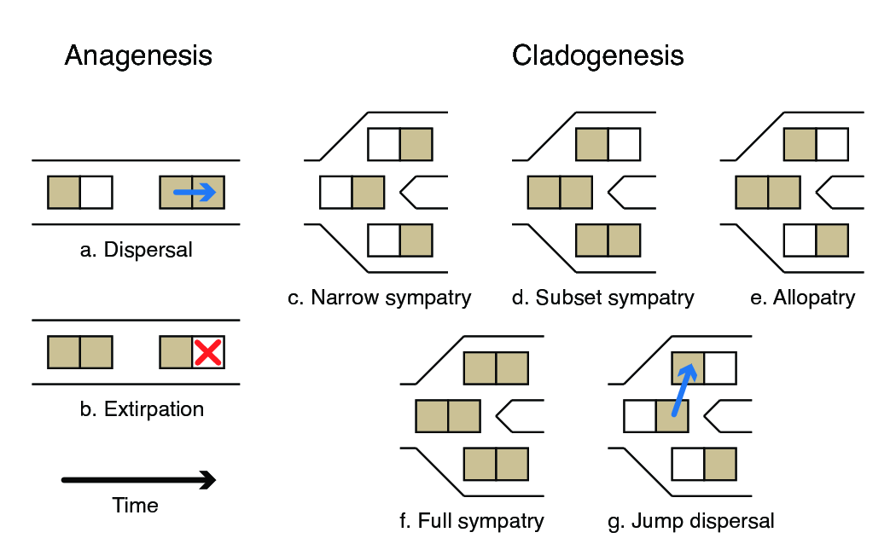

Este tutorial fue traducido y modificado por Ixchel González-Ramírez a partir del tutorial "Introduction to phylogenetic biogeography with the DEC model" disponible [aquí](https://revbayes.github.io/tutorials/biogeo/biogeo_intro.html) y escrito por **Michael J. Landis** y **Sarah K. Swiston**. 

****


## Introducción

Muchos procesos evolutivos fundamentales, como la adaptación, la especiación y la extinción, operan en un contexto espacial. Cuando el aspecto histórico de este contexto espacial no se puede observar directamente, como suele ser el caso, se puede aplicar inferencia biogeográfica para estimar las áreas de distribución de las especies ancestrales. Esto funciona aprovechando la información filogenética, molecular y geográfica para modelar las distribuciones de las especies como resultado de los procesos biogeográficos. La mejor manera de modelar estos procesos requiere ciertas consideraciones especiales, como por ejemplo, cómo se heredan las áreas de distribución después de los eventos de especiación, cómo los eventos geológicos pueden influir en las tasas de dispersión y qué factores afectan las tasas de dispersión y extirpación. Un desafío técnico importante para modelar la evolución de las áreas de distribución es cómo traducir estos procesos naturales en procesos estocásticos que sigan siendo manejables para la inferencia. Este tutorial proporciona una breve introducción a algunos de estos modelos y luego describe cómo realizar inferencia bayesiana de biogeografía histórica utilizando un modelo de Dispersión-Extinción-Cladogénesis (DEC) en RevBayes.

### Descripción general del modelo de dispersión-extinción-cladogénesis 

El proceso de dispersión-extinción-cladogénesis (DEC) modela la evolución del rango de los linajes como un proceso de cambio discreto . Hay tres componentes clave para entender el modelo DEC: el rango como caracter, evolución anagenética del rango y evolución cladogenética del rango (Fig. 1).

 
**Figura 1.** Esquema del comportamiento del modelo DEC. Se muestran dos eventos anagenéticos (a,b) y cinco eventos cladogenéticos (c–g) para un sistema con dos áreas. Las áreas están sombreadas cuando están habitadas por un linaje determinado y se dejan en blanco cuando están deshabitadas. El tiempo avanza de izquierda a derecha. (a) Dispersión: se añade una nueva área al rango de la especie. (b) Extirpación (o extinción local): el rango de la especie pierde un área previamente habitada. (c) Simpatría estrecha: cuando el rango ancestral contiene un área, ambos linajes hijos heredan esa área. (d) Simpatría de subconjunto: cuando el rango ancestral es amplio, un linaje hijo hereda el rango ancestral y el otro hereda solo un área. (e) Alopatría (o vicarianza): cuando el rango ancestral es amplio, un linaje hijo hereda un subconjunto de las áreas ancestrales mientras que el otro linaje hijo hereda todas las áreas ancestrales restantes. (f) Simpatría generalizada: cuando el rango ancestral está muy extendido, ambos linajes hijos heredan el rango ancestral. (g) Dispersión por salto (o especiación fundadora): un linaje hijo hereda el rango ancestral mientras que el otro hereda una nueva área desocupada.


### Caracteres de rango discreto

DEC trata los rangos de taxones como datos de presencia-ausencia, es decir, el rango es el conjunto de áreas discretas (pre-definidas) donde una especie se observa. Por ejemplo, digamos que hay tres áreas, A, B y C. Si una especie está presente en las áreas A y C, entonces su rango es igual a AC, que también se puede codificar en el vector de bits de longitud 3, 101. Los vectores de bits también se pueden transformar en un estado de valor entero, por ejemplo , el número binario 101 es igual al entero 5. Ten en cuenta que hay que agregar 1 al valor entero del estado de interés para acceder a ese estado desde un objeto RevBayes, por ejemplo , el rango AC con valor entero 5 se accede en el índice 6.


 **Tabla 1**. Example of discrete range representations for an analysis with areas
  A, B, and C.

  |    Range    | Bits  | Size | Integer |
  |-------------|-------|------|-------|
  |$$\emptyset$$  |  000  |  0   |   0   |
  |A            |  100  |  1   |   1   |
  |B            |  010  |  1   |   2   |
  |C            |  001  |  1   |   3   |
  |AB           |  110  |  2   |   4   |
  |AC           |  101  |  2   |   5   |
  |BC           |  011  |  2   |   6   |
  |ABC          |  111  |  3   |   7   |



La representación decimal de los estados de rango rara vez se utiliza en las discusiones, pero es útil tenerla en cuenta al considerar el número total de posibles distribuciones para una especie y al procesar los resultados.


### Evolución anagenética del rango

En el contexto del modelo DEC, anagénesis se refiere a la evolución del rango que ocurre entre eventos de especiación dentro de los linajes. Hay dos tipos de eventos anagenéticos, **dispersión** (a) y **extinción (local) o extirpación** (b). Debido a que DEC utiliza rangos de valores discretos, los eventos anagenéticos se modelan utilizando una cadena de Markov de tiempo continuo. Esto, a su vez, nos permite calcular la probabilidad de transición de un carácter que cambia de $$i$$ a $$j$$ en el tiempo $$t$$ a través de la exponenciación matricial $$\mathbf{P}_{ij}(t) = \left[ \exp \left\lbrace \mathbf{Q}t \right\rbrace \right]_{ij}$$, donde $$\textbf{Q}$$ es la matriz de tasa instantánea que define las tasas de cambio entre todos los pares de caracteres, y $$\textbf{P}$$ es la matriz de tasa de probabilidad de transición.
Los índices $$i$$ y $$j$$ representan diferentes rangos, cada uno de los cuales está codificado como el conjunto de áreas ocupadas por la especie. La probabilidad se integra sobre todos los posibles escenarios de transiciones de caracteres que podrían ocurrir durante $$t$$ siempre que la cadena comienceen el rango $$i$$ y termine en rango $$j$$. Después podemos codificar $${\bf Q}$$ para reflejar las clases permitidas de eventos de evolución de rango con parámetros biológicamente significativos. Para tres áreas, las tasas en la matriz de tasas anagenéticas son:

$$\textbf{Q} =
	\begin{array}{c|cccccccc}
		& \emptyset & A & B & C & AB & AC & BC & ABC \\
		\hline
		\emptyset 	& - 	& 0 	& 0 	& 0 		& 0			& 0 		& 0 		& 0 \\
		A 			& e_A 	& - 	& 0 	& 0 		& d_{AB}	& d_{AC} 	& 0 		& 0 \\
		B 			& e_B 	& 0 	& - 	& 0 		& d_{BA}	& 0 		& d_{BC} 	& 0 \\
		C 			& e_C 	& 0 	& 0 	& - 		& 0 		& d_{CA} 	& d_{CB} 	& 0 \\
		AB 			& 0 	& e_B 	& e_A 	& 0 		& -			& 0 		& 0 		& d_{AC} + d_{BC} \\
		AC 			& 0 	& e_C 	& 0 	& e_A 		& 0			& - 		& 0 		& d_{AB} + d_{CB} \\
		BC 			& 0 	& 0 	& e_C 	& e_B 		& 0			& 0 		& - 		& d_{BA} + d_{CA} \\
		ABC 		& 0 	& 0 	& 0 	& 0 		& e_C 		& e_B 		& e_A 		& - \\								
	\end{array}$$

donde $$e = ( e_A, e_B, e_C )$$ son las tasas de extinción local por area,
y $$d = ( d_{AB}, d_{AC}, d_{BC}, d_{BA}, d_{CA}, d_{CB})$$ son las tasas de dispersión entre áreas. Nota que la suma de las tasas que *dejan* el estado nulo ($$\emptyset$$) son zero, lo que significa que cualquier linaje que pierde todas sus áreas, se queda así permanentemente.

Para desarrollar nuestra intuición, construyamos una matriz de tasa DEC en RevBayes.

> Crea un nuevo directorio en tu computadora llamado `RB_biogeo_tutorial`.
>
> Navegua hasta el directorio del tutorial y ejecuta el archivo binario de RevBayes.
>

Supongamos que tenemos tres áreas

    n_areas <- 3

Primero, creamos una matriz de tasas de dispersión entre pares de áreas, con tasas
$$d_{AB} = d_{AC} = \ldots = d_{CB} = 1$$.

    for (i in 1:n_areas) {
        for (j in 1:n_areas) {
            dr[i][j] <- 1.0
        }
    }

A continuación, vamos a crear las tasas de extirpación con valores $$e_A=e_B=e_C=1$$

    for (i in 1:n_areas) {
        for (j in 1:n_areas) {
            er[i][j] <- 0.0
        }
        er[i][i] <- 1.0
    }

Cuando la matriz de tasas de extirpación es una matriz diagonal (es decir, todas las entradas no diagonales son cero), las tasas de extirpación son mutuamente independientes como en . En otros escenarios se podrían explorar modelos más complejos que penalizan áreas de distribución extensas que abarcan áreas desconectadas.

Para continuar, creamos la matriz de tasas DEC a partir de las tasas de dispersión (dr) y las tasas de extirpación (er).

    Q_DEC := fnDECRateMatrix(dispersalRates=dr, extirpationRates=er)
    Q_DEC

~~~
    [ [ 0.0000, 0.0000, 0.0000, 0.0000, 0.0000, 0.0000, 0.0000, 0.0000 ] ,
        1.0000, -3.0000, 0.0000, 0.0000, 1.0000, 1.0000, 0.0000, 0.0000 ] ,
        1.0000, 0.0000, -3.0000, 0.0000, 1.0000, 0.0000, 1.0000, 0.0000 ] ,
        1.0000, 0.0000, 0.0000, -3.0000, 0.0000, 1.0000, 1.0000, 0.0000 ] ,
        0.0000, 1.0000, 1.0000, 0.0000, -4.0000, 0.0000, 0.0000, 2.0000 ] ,
        0.0000, 1.0000, 0.0000, 1.0000, 0.0000, -4.0000, 0.0000, 2.0000 ] ,
        0.0000, 0.0000, 1.0000, 1.0000, 0.0000, 0.0000, -4.0000, 2.0000 ] ,
        0.0000, 0.0000, 0.0000, 0.0000, 1.0000, 1.0000, 1.0000, -3.0000 ] ]
~~~


Calculamos las probabilidades de transición anagenética para una rama de longitud 0.2.

    tp_DEC <- Q_DEC.getTransitionProbabilities(rate=0.2)
    tp_DEC

~~~
    [ [ 1.000, 0.000, 0.000, 0.000, 0.000, 0.000, 0.000, 0.000],
      [ 0.000, 0.673, 0.013, 0.013, 0.123, 0.123, 0.005, 0.050],
      [ 0.000, 0.013, 0.673, 0.013, 0.123, 0.005, 0.123, 0.050],
      [ 0.000, 0.013, 0.013, 0.673, 0.005, 0.123, 0.123, 0.050],
      [ 0.000, 0.107, 0.107, 0.004, 0.502, 0.031, 0.031, 0.218],
      [ 0.000, 0.107, 0.004, 0.107, 0.031, 0.502, 0.031, 0.218],
      [ 0.000, 0.004, 0.107, 0.107, 0.031, 0.031, 0.502, 0.218],
      [ 0.000, 0.021, 0.021, 0.021, 0.107, 0.107, 0.107, 0.616]]
~~~

Observa cómo la estructura de la matriz de tasas se refleja en la matriz de probabilidad de transición. Por ejemplo, los rangos que están separados por múltiples eventos de dispersión y extirpación son los más improbables: la transición de A a BC requiere un mínimo de tres eventos y tiene una probabilidad de 0,005.

También observa que la probabilidad de entrar o salir del rango nulo es cero. De forma predeterminada, RevBayes condiciona el proceso de evolución del rango anagenético a nunca entrar en el rango nulo al calcular las probabilidades de transición (`nullRange="CondSurv"`). Esto permite que el modelo simule e infiera utilizando las mismas probabilidades de transición.  notaron por primera vez que el rango nulo, un estado absorbente no observado, da como resultado estimaciones anormales de la tasa de extirpación y del tamaño de los rangos. Su propuesta de solución de eliminar el rango nulo del conjunto de estados se habilita con la configuración `nullRange="Exclude"`. La configuración `nullRange="Include"` no proporciona un manejo especial del rango nulo y produce las probabilidades brutas de Ree et al. (2005) .

### Evolución cladogenética del rango

El componente cladogenético del modelo DEC describe el cambio evolutivo que ocurre durante los eventos de especiación (c–g). En el contexto de la evolución de rangos, las especies hijas no necesariamente heredan su rango ancestral de manera idéntica. Para cada nodo interno del árbol reconstruido, puede ocurrir uno de varios eventos cladogenéticos, algunos de los cuales se describen a continuación.

Comenzando con el caso más simple, supongamos que el rango de una especie es $$A$$ en el momento previo a un evento de especiación en un nodo interno. Dado que el rango de la especie es de tamaño 1, ambos linajes hijos necesariamente heredan el rango de la especie ancestral ($$A$$). En el lenguaje de DEC, a esto se llama un evento de simpatría estrecha (*narrow sympatry*) (Fig, 1c). Ahora, supongamos que el rango ancestral es $$$ABC$$$. En el marco de la *simpatría de subconjunto*, un linaje hereda de manera idéntica el rango de la especie ancestral, $$ABC$$, mientras que el otro linaje hereda sólo una única área, es decir sólo $$A$$, solo $$B$$ o solo $$C$$ (Fig. 1d). 
Bajo cladogénesis alopátrica, el rango ancestral se divide equitativamente entre los linajes hijos, es decir, un linaje puede heredar $$AB$$ el otro heredada $$C$$ (Fig 1e). 
Para la cladogénesis simpátrica de rango amplio, ambos linajes heredan el rango ancestral $$ABC$$ (Fig. 1f). 
Finalmente, suponiendo que el rango ancestral es $$A$$ la cladogénesis por dispersión por salto da como resultado que uno de los linajes hijo herede el rango ancestral $$A$$, y el otro hereda una zona previamente no ocupada por el linaje ancestral, $$B$$ or $$C$$ (Fig. 1g). Véase  para una excelente descripción de las transiciones de estados cladogenéticos descritas en la literatura (específicamente esta [figura](http://phylo.wikidot.com/biogeobears#BioGeoBEARS_supermodel_graphic)).

Construímos la matriz de probabilidad de eventos cladogenéticos:


    clado_event_types = [ "s", "a" ]
    clado_event_probs <- simplex( 1, 1 )
    P_DEC := fnDECCladoProbs(eventProbs=clado_event_probs,
                             eventTypes=clado_event_types,
                             numCharacters=n_areas)

`clado_event_types` define qué tipos de eventos cladogenéticos se utilizan `"a"` y `"s"` indican alopatría y simpatría de subconjunto, como se describe en . Otros eventos cladogenéticos incluyen dispersión de salto `["j"]`  y simpatría completa `["f"]` . La matriz de probabilidad de eventos cladogenéticos asumirá que `eventProbs` y `eventTypes` tienen el mismo orden.

Imprimimos las probabilidades de transición cladogenética:

    P_DEC


```
       [
         ( 1 -> 1, 1 ) = 1.0000,
         ( 2 -> 2, 2 ) = 1.0000,
         ( 3 -> 3, 3 ) = 1.0000,
         ...
         ( 7 -> 7, 1 ) = 0.0833,
         ( 7 -> 7, 2 ) = 0.0833,
         ( 7 -> 7, 3 ) = 0.0833
       ]
```
{:.rev-output}

La matriz de probabilidad cladogenética se vuelve muy dispersa cuando tenemos un gran número de áreas, por lo que sólo se muestran los valores distintos de cero. Cada fila informa un triplete de estados (el estado ancestral y los dos estados hijos) con la probabilidad asociada con ese evento. Como se trata de probabilidades dado un evento de cladogénesis, la suma de las probabilidades de todos los resultados cladogenéticos posibles, para cierto estado ancestral, es igual a uno.


## Para tener en cuenta

Las probabilidades de cambios anagenético a lo largo de los linajes deben considerar todas las combinaciones de estados iniciales y finales. Para 3 áreas, hay 8 estados y, por lo tanto, hay $$8 \times 8 = 64$$ probabilidades para los pares de estados. Para cambios cladogenéticos, necesitamos probabilidades de transición para todas las combinaciones de estados antes de la cladogénesis, después de la cladogénesis para el linaje izquierdo y después de la cladogénesis para el linaje derecho. Como en el caso anterior, para tres áreas, hay 8 estados y $$8 \times 8 \times 8 = 512$$ probabilidades cladogenéticas.

Por supuesto, este modelo se puede especificar para más de tres áreas. Consideremos qué sucede con el tamaño de **Q** cuando el número de áreas $$N$$ se vuelve grande. Para tres áreas, **Q** es de tamaño $$8 \times 8$$. Para diez áreas, **Q** es de tamaño $$2^{10} \times 2^{10} = 1024 \times 1024$$, que se aproxima a las matrices de mayor tamaño que se pueden exponenciar en un tiempo práctico. Para veinte áreas, **Q** es de tamaño $$2^{20} \times 2^{20} \approx 10^6 \times 10^6$$ y la exponenciación no es factible. Por lo tanto, la selección de áreas discretas para un análisis DEC debe hacerse teniendo en cuenta lo que se espera aprender a través del análisis en sí.


## Bibliography

Landis MJ, Matzke NJ, Moore BR, Huelsenbeck JP 2013. Análisis bayesiano de la biogeografía cuando el número de áreas es grande. Biología sistemática. 62:789–804.  

Massana KA, Beaulieu JM, Matzke NJ, O'Meara BC 2015. Efectos no nulos del rango nulo en modelos biogeográficos: exploración de la estimación de parámetros en el modelo DEC. bioRxiv.:026914. 

Matzke NJ 2012. La especiación por eventos fundadores en el paquete BioGeoBEARS mejora drásticamente las probabilidades y altera la inferencia de parámetros en los análisis DEC de dispersión-extinción-cladogénesis. Frontiers of Biogeography. 4:210.

Matzke NJ 2014. La selección de modelos en la biogeografía histórica revela que la especiación por eventos fundadores es un proceso crucial en los clados insulares. Biología sistemática. 63:951–970. 10.1093/sysbio/syu056

Ree RH, Moore BR, Webb CO, Donoghue MJ, Crandall K. 2005. Un marco de probabilidad para inferir la evolución del rango geográfico en árboles filogenéticos. Evolution. 59:2299–2311. 10.1111/j.0014-3820.2005.tb00940.x

Ree RH, Smith SA 2008. Inferencia de máxima verosimilitud de la evolución del rango geográfico por dispersión, extinción local y cladogénesis. Biología sistemática. 57:4–14. 10.1080/10635150701883881
