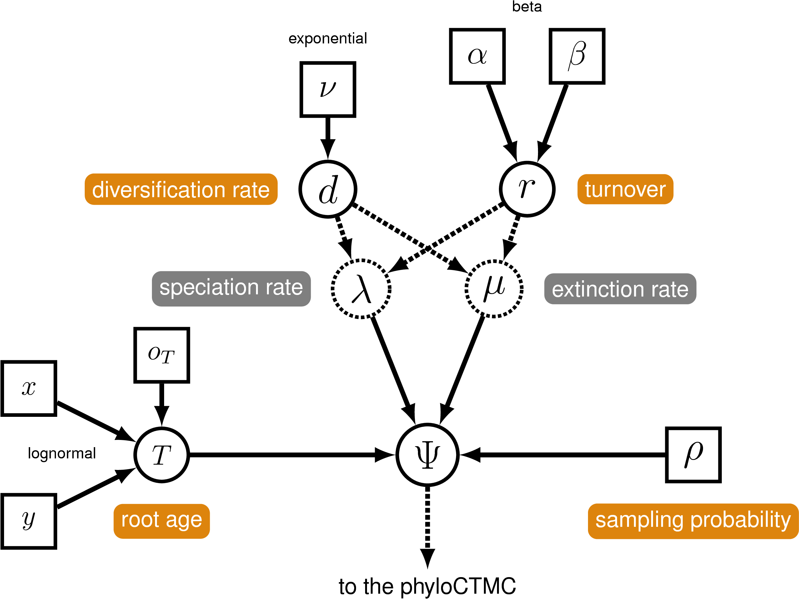

Este tutorial fue traducido y modificado a partir del tutorial "Relaxed Clocks & Time Trees" disponible [aquí](https://revbayes.github.io/tutorials/clocks/) y escrito por Tracy A. Heath. 

[DESCARGA LOS DATOS PARA ESTE TUTORIAL](https://downgit.github.io/#/home?url=https://github.com/ixchelgzlzr/filo_bayes_UNAM/blob/main/docs/clocks/files.zip).  

****

# Introducción
------------

Entre las cuestiones centrales que se exploran en biología, se encuentran aquellas que buscan comprender el ritmo y la velocidad de los procesos evolutivos. Obtener estimaciones precisas de los tiempos de divergencia de las especies es vital para comprender la biogeografía histórica, estimar las tasas de divergencia e identificar las causas de la variación en las tasas de evolución molecular.  

Este tutorial te proporcionorá una descripción general de cómo se estiman tiempos de divergencia utilizando calibración con fósiles y comparando modelos de reloj en un marco bayesiano. El ejercicio te guiará a través de los pasos necesarios para estimar las relaciones filogenéticas y datar las divergencias entre las especies utilizando el programa [RevBayes](http://revbayes.github.io/) (Hoehna2014b, Hoehna2016b).


## Para empezar
---------------

Los distintos ejercicios de este tutorial te guiarán por los pasos necesarios para hacer un análisis filogenético de los datos que se proporcionan como ejemplo. Además, te proporcionamos el *output* de cada ejercicio para que puedas verificar tus resultados. (Ten en cuenta que, dado que las MCMC que realices empezarán en valores diferentes, obtenidos de *semillas* (seeds) generadas aleatoriamente, el output de tus análisis no será idéntico a los que le proporcionamos).

El alineamiento en el archivo `data/bears_irbp.nex` contiene secuencias de proteínas de unión a retinoides interfotorreceptores (irbp) para cada una de las especies contemporáneas de osos.

En este ejercicio, compararemos diferentes modelos de reloj relajado y estimaremos una distribución posterior de cronogramas. El conjunto de datos que utilizaremos es una alineación de 10 secuencias de caniformes, que incluye 8 osos, 1 foca moteada y 1 lobo gris. Además, utilizaremos el tiempo de aparición del fósil de caniforme _Hesperocyon gregarius_ para informar nuestro prior sobre la edad de la raíz del árbol (es decir, el ancestro común más reciente de los caniformes).


## Preparación de los scripts
------------------

En este tutorial implementaremos tres modelos diferentes de reloj relajado y un modelo de nacimiento-muerte (birth-death model, BD, BD tree) para el árbol. Debido a la complejidad de estos modelos, la mejor manera de realizar este ejercicio es especificar cada uno de ellos en un script diferente. Al comienzo de cada sección, te sugeriremos un nombre para cada script; estos nombres corresponden a los scripts proporcionados en los archivos del tutorial que descrgaste al inicio. 

***Estructura del directorio***

Este tutorial requiere que tengas una estructura de directorio muy específica al ejecutar RevBayes. Primero, puede que desee [colocar el binario de RevBayes en tu $PATH](./antes_del_taller) si estás utilizando un sistema operativo basado en Unix. Alternativamente, puedes colocar el archivo ejecutable en el directorio desde el cual se ejecutará RevBayes, por ejemplo, el directorio del tutorial. El directorio del tutorial puede ser cualquier directorio en su sistema de archivos, pero puede que desee crear uno nuevo para evitar conflictos con otros tutoriales de RevBayes.

>Crea un directorio para este tutorial llamado `RB_ClockModels_Tutorial` (o cualquier nombre que desee) y navega hasta ese directorio. Este es el directorio del tutorial mencionado anteriormente.
{:.instruction}

Para este ejercicio, el script requiere que dentro del folder del tutorial haya ciertos subfolderes específicos. Estos sub-directorios deben tener los mismos nombres que se indican aquí, a menos que quieras modificar tu script para que use nombres diferentes a los que definimos aquí. 

El primer subdirectorio contendrá los archivos de datos (que descargaste al inicio).

>Crea un folder llamado `data` dentro del folder de tu tutorial.
>
>Guarde los archivos de árbol y el alineamiento descargados anteriormente en el subdirectorio `data`.
{:.instruction}

El segundo subdirectorio debe contener los archivos `.Rev` que crearemos en este tutorial.

>Crea un folder llamado `scripts` dentro del folder de tu tutorial.
{:.instruction}

Este tutorial te guiará para crear todos los archivos necesarios para ejecutar los análisis sin necesidad de escribir los comandos directamente en la consola de RevBayes. Dado que los scripts deben apuntar a los archivos de modelo y análisis de forma modular, es importante tener en cuenta la estructura de directorios y, si decides hacer algo diferente, asegúrate de que el directorio del archivo proporcionadas en el tutorial sea correctas.

Por último, necesitaremos un directorio para todos los archivos que nuestros análisis van a arrojar. Para algunas operaciones, RevBayes puede crear este directorio por sí mismo, sin embargo, es más seguro agregarlo ahora.

>Crea un folder llamado `output` en el directorio de tu tutorial.
{:.instruction}


## El modelo BD (*Birth-death*)
---------------------

El proceso BD que utilizaremos es un proceso de tasas constantes condicionado por la edad de la raíz del árbol.


 
**Fig. 1.** Modelo gráfico que representa el proceso BD condicionado por la edad de la raín en RevBayes


***Crear el archivo Rev***
>Abre tu editor de texto y crea el archivo del modelo BD llamado `m_BDP_bears.Rev` en el directorio `scripts`.

>Copia el código Rev proporcionado en esta sección en este archivo.
{:.instruction}

***Leer en un árbol a partir de un estudio anterior***

A veces resulta conveniente cargar un árbol de un estudio anterior, el cual se puede utilizar como árbol de partida. Leeremos el árbol estimado por (DosReis 2012).

```
T <- readTrees("data/bears_dosReis.tre")[1]
```
Podemos utilizar este árbol para inicializar algunas variables útiles. (Estas también pueden crearse a partir de la matriz de datos utilizando los mismos métodos).
```
n_taxa <- T.ntips()
taxa <- T.taxa()
```
Finalmente, inicializamos una variable para nuestro vector de movimientos y monitores.
```
moves    = VectorMoves()
monitors = VectorMonitors()
```


### Parámetros del modelo BD

Comenzaremos estableciendo los parámetros del modelo y los movimientos (_moves_) del modelo de nacimiento-muerte (BD). Hay muchas maneras de especificar este modelo, pero en esta ocasión definiremos los parámatros "diversificación" y "recambio". 

***Tasa de diversificación***

La tasa de diversificación (d) es la tasa is the especiación (λ) menos la tasa de extinción (μ): d = λ - μ.
```
# definimos un prior en la tasa de diversificación
diversification ~ dnExponential(10.0) 

# agregamos moves
moves.append( mvScale(diversification, lambda=1.0, tune=true, weight=3.0) )
```

***Tasa de recambio***

La tasa de recambio es: r = μ / λ.
```
turnover ~ dnBeta(2.0, 2.0) 
moves.append( mvSlide(turnover,delta=1.0,tune=true,weight=3.0) )
```

***Nodos deterministas para tasas de nacimiento (B) y muerte (D)***

La tasa de nacimiento y la tasa de muerte son funciones deterministas de la tasa de diversificación y la tasa de recambio. Primero, creamos un nodo determinista para `1 − r`, que es el denominador de ambas fórmulas.
```
denom := abs(1.0 - turnover) 
```
Ahora, ambas tasas serán números reales positivos que resultan de transformaciones de las variables estocásticas que definimos anteriormente.
```
birth_rate := diversification / denom
death_rate := (turnover * diversification) / denom
```

***La probabilidad de muestreo***

Fijamos la probabilidad de muestreo ya que _conocemos_ su valor. Dado que hay aproximadamente 147 especies de caniformes descritas y nuestro análisis contiene 10, crearemos un nodo constante para este parámetro que sea igual a 10/147.

```
rho <- 0.068
```

### Prior en la edad de la raíz

El fósil _Hesperocyon gregarius_ es un fósil descendiente del ancestro común más reciente (MRCA) de todos los caniformes y aparece en el registro fósil hace ∼38 millones de años. Por lo tanto, podemos suponer que la probabilidad de que la edad de la raíz sea menor a 38 millones de años es igual a 0, y podemos utilizar este valor para asignar un prior para la edad de la raíz.

Primero especificamos la edad de aparición del fósil.
```
tHesperocyon <- 38.0
```
Asumiremos una distribución log normal para el prior de la raíz, con un desfase (offset) correspondiente 
a la edad del fosil _Hesperocyon gregarius_. También, podemos utilizar el análisis de (Dos Reis 2012) para parametrizar dicha distribución. La edad que ellos reportan para el MRCA de los caniformes es 49 millones de años. Por lo tanto, podemos especificar la media de nuestra distribución para que se encuentre en medio de su estimación y la edad del fósil, 49 − 38 = 11. 
Dados los valores esperados para la media (mean_ra) y la desviación estándar (stdv_ra), calculamos el valor de la media en la escala logarítmica (mu_ra).

    mean_ra <- 11.0
    stdv_ra <- 0.25
    mu_ra <- ln(mean_ra) - ((stdv_ra*stdv_ra) * 0.5)

Con estos parámetros podemos especificar el nodo estocástico de la edad raíz:

    root_time ~ dnLognormal(mu_ra, stdv_ra, offset=tHesperocyon)

    # Si quieres visualizar el prior, puedes copiar esta línea en el gadget discutido en clase:
    # root_time ~ dnLognormal(2.33, 0.25, offset=38)
   

### Nodo estocástico del cronograma

Ahora que ya hemos especificado todos los parámetros del proceso BD, podemos crear nuestro nodo estocástico que representa la topología del árbol y los tiempos de divergencia.

    timetree ~ dnBDP(lambda=birth_rate, mu=death_rate, rho=rho, rootAge=root_time, samplingStrategy="uniform", condition="nTaxa", taxa=taxa)

### Edad de un nodo en específico

En caso de que nos interese un nodo en particular y queramos guardar la edad de ese nodo en el archivo de salida, podemos crear un nodo determinista para la edad de ese nodo. Primero, definimos el nodo usando el conjunto de taxa que son parte de ese grupo utilizando la función `clade()`. Esto no restringirá este nodo a ser monofilético, sino que simplemente creará un nodo que sea el MRCA de los taxones enumerados (incluso si ese nodo tiene descendientes que no están nombrados).

    clade_Ursidae <- clade("Ailuropoda_melanoleuca","Tremarctos_ornatus","Helarctos_malayanus", "Ursus_americanus","Ursus_thibetanus","Ursus_arctos","Ursus_maritimus","Melursus_ursinus")

Una vez que hemos definido el nodo, podemos crear un nodo determinista para monitorear su edad.

    tmrca_Ursidae := tmrca(timetree,clade_Ursidae)

### Propuestas de movimiento en el cronograma

A continuación, crea el vector de movimientos. Estos movimientos actúan sobre las edades de los nodos:

    moves.append( mvNodeTimeSlideUniform(timetree, weight=30.0) ) 
    moves.append( mvSlide(root_time, delta=2.0, tune=true, weight=10.0) )
    moves.append( mvScale(root_time, lambda=2.0, tune=true, weight=10.0) )
    moves.append( mvTreeScale(tree=timetree, rootAge=root_time, delta=1.0, tune=true, weight=3.0) )

Luego, agregaremos movimientos que propondrán cambios a la topología del árbol.

    moves.append( mvNNI(timetree, weight=8.0) )
    moves.append( mvNarrow(timetree, weight=8.0) )
    moves.append( mvFNPR(timetree, weight=8.0) )

Ahora guarda y cierra este archivo. Este archivo, con todas las especificaciones del modelo, será usado por otros Rev archivos.


## Especificación del modelo de tasas evolutivas en las ramas (clock models)
-----------------------------


Las siguientes secciones te guiarán en la creación de los archivos que especifican diferentes modelos de reloj relajado. Cada sección requerirá que hagas un archivo Rev independiente para cada modelo de reloj, así como para cada análisis de verosimilitud marginal.

### El modelo del reloj molecular global {#globalClockSec}

El reloj molecular global supone que la tasa de sustitución es constante a lo largo del árbol y a través del tiempo.

***Creamos el archivo Rev***

Abre tu editor de texto y crea un archivo para el modelo de reloj molecular global llamado `m_GMC_bears.Rev`en el folder `scripts`.

Copia el código proporcionado en esta sección en este script. Toma en cuenta que estamos código de manera modular que pueden ser utilizados por otros scripts para correr un análisis. Por lo tanto, el código que se muestra a continuación dependerá de ciertas variables inicializadas en otros archivos.

***La tasa del reloj (clock rate)***

El parámetro que representa la tasa del reloj es un nodo estocástico que proviene de una distribución gamma.

    clock_rate ~ dnGamma(2.0,4.0)
    moves.append( mvScale(clock_rate,lambda=0.5,tune=true,weight=5.0) )

***El modelo de evolución molecular y el CTMC filogenético***

Especificamos los parámetros del modelo GTR y los movimientos para que operan en ellos.

```
    sf ~ dnDirichlet(v(1,1,1,1))
    er ~ dnDirichlet(v(1,1,1,1,1,1))
    Q := fnGTR(er,sf)
    moves.append( mvSimplexElementScale(er, alpha=10.0, tune=true, weight=3.0) )
    moves.append( mvSimplexElementScale(sf, alpha=10.0, tune=true, weight=3.0) )
```
Y creamos el nodo phyloCTMC:
```
    phySeq ~ dnPhyloCTMC(tree=timetree, Q=Q, branchRates=clock_rate, nSites=n_sites, type="DNA")
    phySeq.clamp(D)
```
Esto es todo lo que incluiremos en el archivo del modelo de reloj molecular global.

Guarda y cierre el archivo.

***Estimación de la probabilidad marginal***

Ahora podemos utilizar los archivos de modelo que creamos y estimar la probabilidad marginal según el modelo de reloj molecular global (y todas las demás configuraciones del modelo). Puedes ingresar los siguientes comandos directamente en la consola RevBayes o puedes crear otro script.

Abre su editor de texto y crea un archivo llamado `mlnl_GMC_bears.Rev` y guárdalo en el folder `scripts`.

*Cargando los datos del alineamiento*: leemos el archivo con las secuencias e inicializamos algunas variables importantes.

    D <- readDiscreteCharacterData(file="data/bears_irbp.nex")
    n_sites <- D.nchar()
    mi = 1

*El modelo del cronograma:* Cargamos el modelo del árbol calibrado mediante la función `source()`. Nota que en este archivo no especificamos movimientos que operen en la topología del árbol (solo en las edades), lo que resulta útil cuando planeamos estimar las probabilidades marginales y comparar diferentes modelos de reloj relajado.

    source("scripts/m_BDP_bears.Rev")

*Cargue el archivo del modelo GMC:* Cargamos el archivo que contiene todos los parámetros del modelo de reloj molecular global. Este archivo se llama `m_GMC_bears.Rev`.

    source("scripts/m_GMC_bears.Rev")

Ahora podemos crear nuestra variable del modelo completamente especificado. Lo haremos con la función `model()` y solo necesitamos proporcionarle un solo del modelo que especificamos (er).

    mymodel = model(er)

*Ejecutamos el PPS (Power Posterior Sampler) y calculamos las probabilidades marginales del modelo:* con un modelo completamente especificado, podemos configurar el análisis `powerPosterior()` con el que crearemos un archivo de "potencias" y verosimilitudes a partir del cual podemos estimar la verosimilitud marginal mediante el uso de algoritmos como *stepping-stone* o *path sampling*. 
Este método calcula un vector de potencias a partir de una distribución beta y luego ejecuta una ejecución de MCMC para cada paso de potencia mientras se aumenta la verosimilitud a esa potencia. En esta implementación, el vector de potencias comienza con 1, muestreando la verosimilitud cerca de la posterior y muestreando de manera incremental cada vez más cerca de la anterior a medida que disminuye la potencia.

Primero, inicializamos un monitor que registrará las muestras MCMC para cada parámetro en cada paso de la potencia posterior.


<!--This method computes a vector of powers from a beta distribution, then
executes an MCMC run for each power step while raising the likelihood to
that power. In this implementation, the vector of powers starts with 1,
sampling the likelihood close to the posterior and incrementally
sampling closer and closer to the prior as the power decreases.

First, we initialize a monitor which will log the MCMC samples for each
parameter at every step in the power posterior.-->

    monitors[1] = mnModel(filename="output/GMC_posterior_pp.log",printgen=10, separator = TAB)

A continuación, creamos la variable que contiene la potencia posterior. Para ello, debemos proporcionar un modelo y un vector de movimientos, así como el nombre del archivo de salida. El argumento `cats` establece el número de *pasos de potencia* (power steps). Una vez que hemos especificado las opciones para nuestro muestreo, podemos iniciar el análisis.

    pow_p = powerPosterior(mymodel, moves, monitors, "output/GMC_bears_powp.out", cats=50, sampleFreq=10) 
    pow_p.burnin(generations=5000,tuningInterval=200)
    pow_p.run(generations=1000)  

Calculamos la probailidad marginal utilizando dos métodos diferentes: muestreo escalonado y muestreo de ruta.

    ss = steppingStoneSampler(file="output/GMC_bears_powp.out", powerColumnName="power", likelihoodColumnName="likelihood")
    ss.marginal() 

    ### use path sampling to calculate marginal likelihoods
    ps = pathSampler(file="output/GMC_bears_powp.out", powerColumnName="power", likelihoodColumnName="likelihood")
    ps.marginal() 

Si has ingresado todo esto directamente en la consola de RevBayes, verás las probabilidades marginales de cada método impresas en la pantalla. De lo contrario, si has creado el script llamado `mlnl_GMC_bears.Rev` guárdalo y ejecútalo, para ello, escribe lo siguiente en su terminal:

    source("scripts/mlnl_GMC_bears.Rev")

Una vez que hayas completado este análisis, registra las probabilidades marginales del modelo de reloj molecular global en la Tabla 1.

### El modelo de tasas log-normal no correlacionadas (UCLN) {#UCLNModelSec}

El modelo lognormal no correlacionado (UCLN) relaja el supuesto de que existe una tasa global para el reloj molecular. En este modelo, la tasa asociada con cada rama del árbol es un nodo estocástico. Cada uno de los cuáles se obtiene de una misma distribución lognormal.

Dado que quizás no tengamos información previa sobre los parámetros de esta distribución lognormal, podemos asignar hiperpriors a estas variables. En general, es más sencillo construir un hiperprior para la media de una densidad lognormal, en lugar de para el parámetro de ubicación mu. Aquí, supondremos que tanto la tasa de ramificación promedio, como su desviación estándar, se distribuyen exponencialmente. Con estos dos parámetros, podemos obtener el parámetro de ubicación de la distribución lognormal mediante: `μ = log(M) − σ^2`. De este modo, mu es un nodo determinista, definido en función de M y σ. Podemos representar el vector denortetasas de ramificación utilizando la notación de placa.

***Crear el script de Rev***

Abre tu editor de texto y crea un archivo nuevo para el modelo de reloj relajado lognormal no correlacionado llamado `m_UCLN_bears.Rev` en el directorio `scripts`.

Copia el código proporcionado en esta sección. Tome en cuenta que estamos creando archivos de modelo modulares que pueden obtenerse de diferentes archivos de análisis. Por lo tanto, el Rev código que se muestra a continuación seguirá dependiendo de la variable inicializada en diferentes archivos.

***Tasas de cambio de ramas independientes***

Antes de poder configurar la variable para las tasas independientes, debemos saber cuántas ramas existen en el árbol.

    n_branches <- 2 * n_taxa - 2

Comenzaremos con especificar la media de la distribución lognormal a partir de una distribución exponencial.

    ucln_mean ~ dnExponential(2.0)

Después especificamos el nodo de la desviación estándar a partir de una distribución exponencial. distribuido. Y también crearemos un nodo determinista, que es la varianza, $σ^2$.

    ucln_sigma ~ dnExponential(3.0)
    ucln_var := ucln_sigma * ucln_sigma

Ahora podemos declarar la función que nos da el parámetro mu de la distribución lognormal para las tasas del modelo UCLN.

    ucln_mu := ln(ucln_mean) - (ucln_var * 0.5)

Los únicos nodos estocásticos para los que necesitamos agregar propuestas de movimiento para esta parte del modelo son la media lognormal (ucln_mean) y la desviación estándar (ucln_sigma).

    moves.append( mvScale(ucln_mean, lambda=1.0, tune=true, weight=4.0))
    moves.append( mvScale(ucln_sigma, lambda=0.5, tune=true, weight=4.0))

Ahora podemos crear el vector de nodos estocásticos para la tasa de cambio de cada una de las ramas utilizando un for-loop. Dentro de este loop, también agregamos el movimiento para cada nodo estocástico de cada rama.

    for(i in 1:n_branches){
       branch_rates[i] ~ dnLnorm(ucln_mu, ucln_sigma)
       moves.append( mvScale(branch_rates[i], lambda=1, tune=true, weight=2.))
    }

<!--***Sidebar: Other Uncorrelated-Rates Models***

The choice in the branch-rate prior does not necessarily have to be a
lognormal distribution. Depending on your prior beliefs about how branch
rates vary across the tree, the rates can just as easily be assigned an
exponential distribution (e.g., defines each branch rate as an
independent draw from an exponential distribution centered on 1) or a
gamma distribution (e.g., defines each branch rate as an independent
draw from a gamma distribution centered on 0.5) or any other
distribution on positive-real numbers. The exercises outlined in this
tutorial demonstrate how to compare different models of branch-rate
variation using Bayes factors, and it may also be important to consider
alternative priors on branch rates using these approaches. Importantly,
RevBayes is flexible enough to make the process of comparing these
models very straightforward. **For the purposes of this exercise,
specify a lognormal prior on the branch rates.** -->

Dado que estamos tratando con parámetros semi-identificables, a menudo es útil aplicar una serie de movimientos a las variables que representan las tasas de cambio de las ramas y los tiempos de divergencia. Esto ayudará a mejorar la mezcla (_mixing_) de nuestra MCMC. Aquí agregaremos dos tipos adicionales que actual sobre vectores:

    moves.append( mvVectorScale(branch_rates,lambda=1.0,tune=true,weight=2.0) )
    moves.append( mvVectorSingleElementScale(branch_rates,lambda=30.0,tune=true,weight=1.0) )

La media de las tasas de cambio de las ramas es un nodo determinista fácil de monitorear durante una MCMC, por lo cuál le asignamos un nodo. 

    mean_rt := mean(branch_rates) 

***El modelo de evolución molecular y el CTMC***

Ahora, especificamos las frecuencias estacionarias y las tasas de intercambio de la matriz GTR.

Now, specify the stationary frequencies and exchangeability rates of the
GTR matrix.

    sf ~ dnDirichlet(v(1,1,1,1))
    er ~ dnDirichlet(v(1,1,1,1,1,1))
    Q := fnGTR(er,sf)
    moves.append( mvSimplexElementScale(er, alpha=10.0, tune=true, weight=3.0))
    moves.append( mvSimplexElementScale(sf, alpha=10.0, tune=true, weight=3.0))

Ahora, podemos juntar todo el modelo en el CTMC filogenético y fijar nuestros datos en ese nodo con la función `.clamp()`.

    phySeq ~ dnPhyloCTMC(tree=timetree, Q=Q, branchRates=branch_rates, nSites=n_sites, type="DNA")
    attach the observed sequence data
    phySeq.clamp(D)

Guarda y cierra el archivo en el directorio `scripts`.

***Estimar la probabilidad marginal***

Tal como lo hicimos para el modelo del reloj estricto, podemos correr un análisis de potencia posterior (power posterior) para calcular la probabilidad marginal del modelo UCLN.

Abre tu editor de texto y crea un archivo nuevo para el análisis de probabilidad marginal y guárdalo en el directorio `scripts` con el nombre `mlnl_UCLN_bears.Rev`.

**Ejericio:** Consulta la sección que describe este proceso para el modelo de reloj global. Escribe tu propio código para estimar la probabilidad marginal para el modelo UCLN. Asegúrate de cambiar los nombres de los archivo en todos los lugares relevantes (por ejemplo, el archivo de salida para la `powerPosterior()` y asegúrate usar `source()` el archivo de modelo correcto).

Una vez que hayas completado este análisis, registre las probabilidades marginales bajo el modelo UCLN en la Tabla de abajo.


## Factores de Bayes y selección de modelo
--------------------------------------

Ahora que tenemos las estimaciones de la probabilidad marginal bajo cada ambos modelos de reloj, podemos evaluar su plausibilidad relativa utilizando factores de Bayes. Utiliza la **Tabla 1** de probabilidades marginales estimadas por medio de los algoritmos *Path-Sampling* y *Stepping-Stone*.


 |                  **Model**                        |   **Path-Sampling**   |   **Stepping-Stone-Sampling**   |
  --------------------------------------------------:|:---------------------:|:-------------------------------:|
 | [Reloj Molecular Global ($$M_0$$)](#globalClockSec) |                       |                                 |
 | [UCLN ($$M_1$$)](#UCLNModelSec)           |                       |                                 |
 |              Supported model?                     |                       |                                 |

**Tabla 1.** Probabilidades marginales del reloj molecular global y el UCLN.
  

Los programas de filogenética transforman logarítmicamente las probabilidad para evitar el [desbordamiento aritmético](https://es.wikipedia.org/wiki/Desbordamiento_aritmético), porque multiplicar probabilidades resulta en números que son demasiado pequeños para almacenarse en la memoria de la computadora. Por lo tanto, debemos calcular el factor ln-Bayes (denotaremos este valor $$\mathcal{K}$$):


$$\begin{aligned}
\mathcal{K}=\ln[BF(M_0,M_1)] = \ln[\mathbb{P}(\mathbf X \mid M_0)]-\ln[\mathbb{P}(\mathbf X \mid M_1)],
\end{aligned}$$


donde $\ln[\mathbb{P}(\mathbf X \mid M_0)]$ es la probabilidad marginal logarítmica estimada para el modelo $M_0$. El valor resultante de esta ecuación se puede convertir en un factor de Bayes en escala natural simplemente tomando el exponente de $$\mathcal{K}$$. 

$$\begin{aligned}
BF(M_0,M_1) = e^{\cal{K}}.
\end{aligned}$$ 


Alternativamente, se puede interpretar directamente la evidencia a favor dedel modelo $M_0$ en el espacio logarítmico al comparar los valores de κ en la escala apropiada (Tabla 1, segunda columna). En este caso, evaluamos $$\mathcal{K}$$ de modo que:


if $$\mathcal{K} > 1$$, model $$M_0$$ is preferred


if $$\mathcal{K} < -1$$, model $$M_1$$ is preferred.


Por lo tanto, valores de $$\mathcal{K}$$ cercanos a 0 indican que no hay preferencia por ninguno de los modelos.

Utilizando los valores ingresados ​​en la **Tabla 1**, calcula los ln-BF (usando κ) para los modelos que comparamos. Ingresa tus respuestas en la **Tabla 2** utilizando tanto la aproximación de *stepping stone* y de *path sampling*.


 |                  **Model**                      |   **Path-Sampling**   |   **Stepping-Stone-Sampling**   |
  ------------------------------------------------:|:---------------------:|:-------------------------------:|
 | $$M_0$$,$$M_1$$                                       |                       |                                 |
 |              Supported model?                   |                       |                                 |


**Tabla 2.** lnBF de los dos modelos comparados utilizando dos algoritmos para calcular las probabilidades marginales.


## Estimación de la topología y los tiempos de divergencia
--------------------------------------


Después de calcular los factores de Bayes y determinar el soporte relativo de cada modelo, podemos elegir el modelo más adecuado entre los dos modelos que comparamos en este tutorial. El siguiente paso es utilizar una MCMC para estimar conjuntamente la topología del árbol y los tiempos de divergencia.

Abre tu editor de texto y crea un archivo llamado `mcmc_TimeTree_bears.Rev` y guárdalo en el directorio `scripts`.

Este archivo contendrá gran parte del código que utilizamos para los análisis de probabilidad marginal.

    ### Load the sequence alignment
    D <- readDiscreteCharacterData(file="data/bears_irbp.nex")

    ### get helpful variables from the data
    n_sites <- D.nchar(1)

    ### initialize an iterator for the moves vector
    mi = 1

El siguiente paso es obtener el modelo BD (birth-death) para el árbol:

    ### set up the birth-death model from file
    source("scripts/m_BDP_bears.Rev")

A continuación, cargue el archivo que contiene su modelo favorito (donde el comodín `\*` indica el nombre del modelo preferido: `GMC`, `UCLN`).

    ### load the model from file 
    source("scripts/m_*_bears.Rev")

    ### workspace model wrapper ###
    mymodel = model(er)

***Monitores para la MCMC***

Antes iniciar la cadena de MCMC, necesitamos crear un vector de monitores reponsables de monitorear los valores de los parámatros y guardarlos en los archivos de salida o imprimirlos en la pantalla.

En primer lugar, creamos un monitor de todos los parámetros del modelo excepto el cronograma (`timetree`) usando la función `mnModel`. Este monitor toma *todos* los parámetros nombrados en el DAG del modelo y guarda su valor en un archivo de salida. De este modo, cada variable a la que se le haya asignado un nombre en los archivos del modelo se escribirá en el archivo de salida. Esto facilita mucho la puesta en marcha de un análisis, pero puede generar archivos muy grandes con una gran cantidad de información redundante.x

    monitors.append(mnModel(filename="output/TimetTree_bears_mcmc.log", printgen=10))

Si el monitor `mnModel` es demasiado detallado para tus necesidades, puedes utilizar en su lugar el monitor de archivos: `mnFile`. Para este monitor, se deben proporcionar los nombres de los parámetros que se quieren guardar en el archivo de salida y el intervalo de impresión. (Consulta los archivos ejemplo para saber cómo configurar el monitor de archivos para los parámetros del modelo).

De hecho, utilizamos el `mnFile` para guardar los cronogramas muestreados en un archivo. Es importante que **no** se guarden los árboles muestreados en el mismo archivo que el resto de los parámetros numéricos. Esto se debe a que las herramientas para leer archivos de salida de MCMCs, como [Tracer](http://tree.bio.ed.ac.uk/software/tracer/) (Rambaut 2011), no pueden cargar archivos con estados no numéricos. Por lo tanto, se deben guardar los árboles muestreados en un archivo diferente.

    monitors.append(mnFile(filename="output/TimeTree_bears_mcmc.trees", printgen=10, timetree))

Finalmente, crearemos un monitor encargado de mostrar información en la pantalla con la función `mnScreen`. Reportaremos la edad de la raíz (`root_time`) y la edad del MRCA de todos los Ursidae (`tmrca_Ursidae`) en la pantalla. Si hay algo más que te gustaría ver en la pantalla, no dudes en agregarlo a la lista de parámetros.

    monitors.append(mnScreen(printgen=10, root_time, tmrca_Ursidae))

***Configuración y ejecución de la MCMC***

Ahora todo está listo para crear el objeto MCMC en el espacio de trabajo. Este objeto permite realizar un *burn-in*, correr una cadena por una duración determinada, continuar un análisis que podría no haber alcanzado la estacionariedad, y resumir el performance de las propuestas de movimiento que especificamos.

    mymcmc = mcmc(mymodel, monitors, moves)

Con este objeto inicializado, especificamos un período de *burn-in* que tomará muestras del espacio de parámetros mientras reajusta las propuestas (solo para los movimientos con `tune=true`). Los monitores no guardan los estados de la cadena durante el *burn-in*.

    mymcmc.burnin(generations=2000,tuningInterval=100)

Una vez que se complete el proceso de *burn-in*, especificamos la longitud de la cadena para que se ejecute el MCMC completo.

    mymcmc.run(generations=5000)

Cuando se ha completado la ejecución de la MCMC, es conveniente evaluar las tasas de aceptación de las distintos propuestas de movimiento. El método `.operatorSummary()` aplicado al objeto MCMC imprime una tabla que resume cada uno de los movimientos de parámetros en la pantalla.

    mymcmc.operatorSummary()

***Resumir los cronogramas muestreados***

Durante el MCMC, los árboles muestreados se escribirán en un archivo que resumiremos utilizando la función `mapTree` en RevBayes. Para ello, primero leemos el archivo de los árboles (*tree trace*) y después analizamos esos árboles.

    tt = readTreeTrace("output/TimeTree_bears_mcmc.trees", "clock")
    tt.summarize()

    ### exportamos el MAP tree a un archivo
    mapTree(tt, "output/TimeTree_bears_mcmc_MAP.tre")

Guarda y cierre el archivo. Luego, ejecute el análisis MCMC usando:

    source("scripts/mcmc_TimeTree_bears.Rev")

## References 
Höhna S., Landis M.J., Heath T.A., Boussau B., Lartillot N., Moore B.R., Huelsenbeck J.P., Ronquist F. 2016. RevBayes: Bayesian Phylogenetic Inference Using Graphical Models and an Interactive Model-Specification Language. Systematic Biology. 65:726–736. 10.1093/sysbio/syw021

Höhna S., Heath T.A., Boussau B., Landis M.J., Ronquist F., Huelsenbeck J.P. 2014. Probabilistic Graphical Model Representation in Phylogenetics. Systematic Biology. 63:753–771. 10.1093/sysbio/syu039

Rambaut A., Drummond A.J. 2011. Tracer v1.5. . http://tree.bio.ed.ac.uk/software/tracer/

dos Reis M., Inoue J., Hasegawa M., Asher R.J., Donoghue P.C.J., Yang Z. 2012. Phylogenomic datasets provide both precision and accuracy in estimating the timescale of placental mammal phylogeny. Proceedings of the Royal Society B: Biological Sciences. 279:3491–3500. 10.1098/rspb.2012.0683
