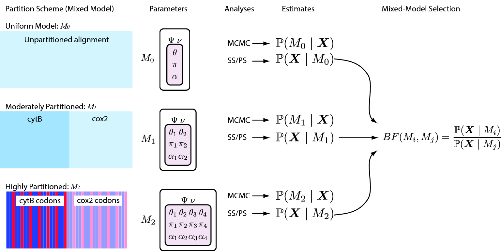

Este tutorial fue traducido y modificado a partir del tutorial "Partitioned data analysis" disponible [aquí](https://revbayes.github.io/tutorials/partition/) y escrito por Sebastian Höhna, Michael J. Landis and Tracy A. Heath. 

[DESCARGA LOS DATOS PARA ESTE TUTORIAL](https://downgit.github.io/#/home?url=https://github.com/ixchelgzlzr/filo_bayes_UNAM/blob/main/docs/partition/files.zip).  

<!--


This tutorial provides the second protocol from our recent publication
. The first protocol is described in the 
and the third protocol is described in the .

This tutorial demonstrates how to accommodate variation in the
substitution process across sites of an alignment. In the preceding
tutorials, we assumed that all sites in an alignment evolved under an
identical substitution process. This assumption is likely to be violated
biologically, since different nucleotide sites are subject to different
selection pressures, such as depending on which gene or codon position
the site belongs to. Here, we will demonstrate how to specify—and select
among—alternative *data partition schemes* using ‘RevBayes‘. This is
commonly referred to as partitioned-data analysis, where two or more
subsets of sites in our alignment are assumed to evolve under distinct
processes.

This tutorial will construct three multi-gene models. The first model,
Partition_uniform, assumes all genes evolve under the same process
parameters. The second model, Partition_gene, assumes all genes evolve
according to the same process, but each gene has its own set of process
parameters. The third model, Partition_codon, partitions the data not
only by gene, but also by codon position. Each analysis will generate a
*maximum a posteriori* tree to summarize the inferred phylogeny. An
advanced exercise introduces how to compute Bayes factors to select
across various partitioning schemes.

All of the files for this analysis are provided for you and you can run
these without significant effort using the ‘source()‘ function in the
‘RevBayes‘ console, *e.g.,*
```
source("scripts/mcmc_Partition_uniform.Rev")
```
If everything loaded properly, then you should see the program begin
running the Markov chain Monte Carlo analysis needed for estimating the
posterior distribution. If you continue to let this run, you will
see it output the states of the Markov chain once the MCMC analysis
begins.-->


## Introducción

Se reconoce ampliamente que existe variación en la evolución entre distintos sitios de un alineamiento de DNA. 
Y esta variación es una característica generalizada en los datos que incluyen múltiples genes, loci y/o genomas. 
Cuando hacemos inferencias filogenéticas a partir de conjuntos de datos como estos, es necesario que utilicemos 
modelos que toman en cuenta esta heterogeneidad en la evolución de los sitios. El no hacerlo, puede arrojar estimaciones sesgadas de árboles filogenéticos y otros parámetros de interés.

<!--
Variation in the evolutionary process across the sites of nucleotide
sequence alignments is well established, and is an increasingly
pervasive feature of datasets composed of gene regions sampled from
multiple loci and/or different genomes. Inference of phylogeny from
these data demands that we adequately model the underlying process
heterogeneity; failure to do so can lead to biased estimates of
phylogeny and other parameters . -->

Para tomar en cuenta la heterogeneidad en los procesos evolutivos necesitamos dividir (_partition_ en inglés) nuestros datos. A esto también se le conoce como "modelos mixtos" o _mixed-models_ (), en los que los caracteres (e.g.alineamientos de DNA o caracteres morfológicos) primero se separan en subgrupos que buscan representar la hetereogenidad del proceso que genero tales datos.
El esquema de división (_partitioning scheme_) es guíado por consideraciones biologicas específicas de los datos que estamos utilizando. Por ejemplo, podríamos querer evaluar la variación en la evolución de dentro de un mismo gen (e.g., entre la región del tallo y del bucle de una sequencia del ribosoma), o entre distintos genes de un alineamiento concatenado (e.g., un alineamiento que incluse multiples loci de distintos genomas). La elección de cómo dividir los datos está a consideración del investigador y varios esquemas de división pueden ser considerados para los datos típicamente usados en inferencia filogenética.


<!--Accounting for process heterogeneity involves adopting a partitioned
data approach (sometimes also called a ‘mixed-model’ approach
), in which the sequence alignment is first parsed into a
number of data subsets that are intended to capture plausible process
heterogeneity within the data. The determination of the partitioning
scheme is guided by biological considerations regarding the dataset at
hand. For example, we might wish to evaluate possible variation in the
evolutionary process within a single gene region
(e.g., between stem and loop regions of
ribosomal sequences), or among gene regions in a concatenated alignment
(e.g., comprising multiple nuclear loci
and/or gene regions sampled from different genomes). The choice of
partitioning scheme is up to the investigator and many possible
partitions might be considered for a typical dataset.--> 

En este ejercicio asumiremos que cada subconjunto de datos evolucionó independientemente bajo un modelo GTR + Γ (modelo general de tiempo reversible con variación entre sitios distribuidas de acuerdo a una función Gamma). En este modelo, los datos observados son condicionalmente dependientes de las tasas de sustitución (θ), las frecuencias estacionarias de los nucleotidos (π), y el grado de variación de la distribución Gamma que define las variación entre sitios (α), así como el árbol enraizado en el que evolucionaron (Ψ) incluyendo la longitud de sus ramas.
Cuando asumimos distintos modelos GTR + Γ para cada subgrupo de datos, estamos utilizando un modelo compuesto, en el que asumimos que todos los sitions tienen una topología en común, así como longitudes de ramas proporcionales, pero a la vez asumimos que cada subgrupo de sitios tiene parámetros del modelo de substitución independientes. Finalmente, llevamos a cabo una simulación de MCMC para aproximar la probabilidad posterior (PP) conjunta de la filogenia y los otros parámetros.

<!--In this exercise, we assume that each data subset evolved under an
independent general-time reversible model with gamma-distributed rates
across sites (GTR+$\Gamma$). Under this model the observed data are
conditionally dependent on the exchangeability rates ($\theta$),
stationary base frequencies ($\pi$), and the degree of gamma-distributed
among-site rate variation ($\alpha$), as well as the rooted tree
($\Psi$) and branch lengths. When we assume different GTR+$\Gamma$
models for each data subset, this results in a composite model, in which
all sites are assumed to share a common, rooted tree topology and
proportional branch lengths, but subsets of sites are assumed to have
independent substitution model parameters. Finally, we perform a
separate MCMC simulation to approximate the joint posterior probability
density of the phylogeny and other parameters.--> 

Para la mayoría de los alineamientos de secuencias de DNA, existen varios (incluso muchos) esquemas de partición de distintos niveles de complejidad que resultan plausibles *a priori*, por lo que es necesario que tengamos una manera objetiva de identificar el esquema de partición que tenga el mejor balance entre obtener una estimación sesgada (cuando se usan modelos sub-parametrizados o simplistas) y el error en la variación de los parámetros (asociado con la sobre-parametrizazion) de los modelos mixtos. Cada vez más, la selección del modelo de partición se basa en factores de Bayes (*Bayes factors*), lo que implica primero calcular la probabilidad marginal bajo cada esquema de partición y luego comparar el cociente de las probabilidades marginales obtenidos para cada partición. La secuencia de análisis que utilizaremos en este tutorial se representa en la Figura 1.

 
_**El proceso de análisis para el ejercicio 1**. Exploraremos tres esquemas de partición para el conjunto de datos de primates. El primer modelo (el "modelo uniforme") asume que todos los sitios evolucionaron bajo un mismo modelo de sustitución GTR + Γ. El segundo modelo (el modelo "moderadamente particionado") utiliza dos subconjuntos de datos correspondientes a los dos genes del alineamiento (cytB y cox2), y supone que cada uno de estos subconjuntos evolucionó independientemente bajo su propio modelo GTR + Γ. El modelo de partición final (el modelo 'altamente particionado') tiene cuatro subconjuntos de datos: los dos primeros subconjuntos corresponden a la región del gen cytB, donde los sitios de la primera y la segunda posición del codón se combinan en un subconjunto distinto de los sitios de la tercera posición del codón, y el gen cox2 tiene dos subconjuntos propios, divididos por posiciones de codón de la misma manera. Asumimos que cada subconjunto de datos evolucionó independientemente bajo su propio modelo GTR + Γ. Nótese que en los tres esquemas de partición asumimos que todos los sitios comparten una topología de árbol en común y proporciones de longitud de rama. Para cada modelo de partición, realizamos una simulación MCMC para aproximar la densidad de probabilidad posterior conjunta de los parámetros del modelo de partición._


## 1) Análisis concatenado, no particionado

Nuestro primer ejercicio consiste en un análisis multigénico donde todos los genes evolucionan bajo el mismo proceso y parámetros.

### Configuración del modelo

#### Cargar y preparar los datos

Para comenzar, cargaremos las secuencias utilizando la función 'readDiscreteCharacterData()'.

```
data_cox2 = readDiscreteCharacterData("data/primates_and_galeopterus_cox2.nex")
data_cytb = readDiscreteCharacterData("data/primates_and_galeopterus_cytb.nex")
```
Dado que estamos asumiendo el mismo modelo para todos los genes, necesitamos combinar los dos conjuntos de datos usando 'concatenar()'
```
data = concatenate( data_cox2, data_cytb )
```
Si tecleamos 'data', obtenemos el reporte sobre las dimensiones de la matriz concatenada:
```
   DNA character matrix with 23 taxa and 1837 characters
   =====================================================
   Origination:                   "primates_and_galeopterus_cox2.nex"
   Number of taxa:                23
   Number of included taxa:       23
   Number of characters:          1837
   Number of included characters: 1837
   Datatype:                      DNA
```

Guardaremos la información de los taxa ('taxa'), el número de taxa ('n_taxa') y el número de ramas, ya que lo utilizaremos más tarde. 

```
n_taxa <- data.ntaxa()
num_branches <- 2 * n_taxa - 3
taxa <- data.taxa()
```
Enseguida, creamos nuestros vectores de movimientos (*moves*) y monitores (*monitors*).
```
moves    = VectorMoves()
monitors = VectorMonitors()
```

#### Modelo de sustitución
  
Ahora podemos proceder con la especificación de nuestro modelo GTR + Γ. En primer lugar, definiremos y especificaremos un prior para las tasas de intercambio (*exchangeability rates*) del modelo GTR.
```
er_prior <- v(1,1,1,1,1,1) 
er ~ dnDirichlet( er_prior )
```
Y les asignamos sus movimientos
```
moves.append( mvBetaSimplex(er, alpha=10, tune=true, weight=3) )
moves.append( mvDirichletSimplex(er, alpha=10.0, tune=true, weight=1.0) )
```
Podemos utilizar el mismo tipo de distribución para el prior en las 4 frecuencias estacionarias (π_A, π_C, π_G, π_T) ya que estos parámetros también representan proporciones. Así pues, especificamos una densidad "Dirichlet plana" como prior para las frecuencias de los nucleótidos:
```
pi_prior <- v(1,1,1,1) 
pi ~ dnDirichlet( pi_prior )
```
Ahora agregamos movimientos en las frecuencias estacionarias
```
moves.append( mvBetaSimplex(pi, alpha=10, tune=true, weight=2) )
moves.append( mvDirichletSimplex(pi, alpha=10.0, tune=true, weight=1.0) )
```
Podemos terminar de especificar esta parte del modelo creando un nodo determinista para la matriz GTR de tasas instantáneas, 'Q'. La función 'fnGTR()' toma un conjunto de tasas de intercambio y un conjunto de frecuencias de bases para calcular la matriz de tasas instantáneas (Q), que utilizaremos para calcular la versosimilitud (likelihood) de nuestro modelo.

```
Q := fnGTR(er,pi)
```

#### Variación de las tasas de sustitución entre sitios

También asumiremos que las tasas de sustitución varían entre sitios del alineamiento de acuerdo con una distribución gamma (definida por un parámetro), es decir, donde el parámetro de la forma es igual al parámetro de la tasa (a = b) y, por lo tanto, con una media de 1.0  . Dado que no tenemos un buen conocimiento previo sobre la varianza de las tasas de sustitución entre sitios, aplicamos una distribución uniforme entre 1 y 10^8. Después, creamos un nodo estocástico llamado 'alpha' con un prior uniforme:


```
alpha ~ dnUniform( 0, 1E8 )
```
La forma en que se implementa el modelo ASRV (among sites rate variation) implica discretizar una distribución gamma de media=1 en un número determinado de categorías de tasas. De este modo, podemos marginalizar analíticamente la incertidumbre en la tasa de cada sitio. Para ello, necesitamos un nodo determinista que sea un vector de tasas calculadas a partir de la distribución gamma y el número de categorías de tasas. Esto se realiza con la función 'fnDiscretizeGamma()' que arroja este nodo determinista y requiere tres argumentos: la forma y la tasa de la distribución gamma y el número de categorías. Dado que queremos discretizar una distribución gamma de media = 1, podemos utilizar 'alpha' tanto para la forma, como para la tasa.

Inicializamos el vector de nodo determinista 'gamma_rates' utilizando la función 'fnDiscretizeGamma()' con '4' categorías:
```
gamma_rates := fnDiscretizeGamma( alpha, alpha, 4, false )
```
La variable aleatoria que controla la variación de la tasa es el nodo estocástico 'alpha'. Esta variable es un valor único, real y positivo ('RevType = RealPos'). Aplicaremos un movimiento simple (*scale*) a este parámetro. El parámetro de ajuste del movimiento de escala se llama 'lambda' y este valor dicta el tamaño de la propuesta (*proposal*).

```
moves.append( mvScale(alpha, lambda=0.1, tune=false, weight=4.0) )
```

#### Sitios Invariables

Los sitios invariable (sitios que permanecen fijos a lo largo de su historia evolutiva) pueden considerarse un caso extremo de variación de la tasa entre sitios. En contraste con el modelo + Γ, el modelo + I permite que el sitio tenga cierta probabilidad de tener una tasa de sustitución igual a cero. Aquí, parametrizamos la probabilidad de que un sitio sea invariable con 'pinvar'. Y agregamos movimientos a este parámetro:
```
pinvar ~ dnBeta(1,1)
moves.append( mvBetaProbability(pinvar, delta=10.0, tune=true, weight=2.0) )
```


#### Prior en el Árbol

La topología del árbol y las longitudes de las ramas también son nodos estocásticos en nuestro modelo. Para simplificar, utilizaremos la misma distribución previa en la topología del árbol, una distribución previa de topología uniforme, y las longitudes de las ramas, distribuciones previas exponenciales independientes, como se hizo en los modelos de sustitución de nucleótidos .

Asumiremos que todas las topologías de árboles no enraízados tienen la misma probabilidad. Esta probabilidad está reflejada por la distribución `dnUniformTopology()` en `RevBayes`. 
Hay que tener en cuenta que en `RevBayes` es recomendable especificar el grupo externo para su sistema de estudio si se utiliza un árbol sin raíz a priori. En otros softwares, como `MrBayes`, se toma el primer taxón de la matriz de datos como grupo externo. 
Así pues, especificamos el nodo estocástico 'topology' con la función `dnUniformTopology()` usando los nombres de los terminales 'names':
```
out_group = clade("Galeopterus_variegatus")
topology ~ dnUniformTopology(taxa, outgroup=out_group)
```
Para explorar la topología del árbol sin raíz, podemos utilizar tanto un movimiento de intercambio de vecino más cercano (`mvNNI`) como un movimiento de poda y reinjerto de subárbol (`mvSPR`). Estos movimientos no tienen parámetros de ajuste asociados, por lo que solo es necesario pasar el nodo `topology` y el peso (*weight*() de la propuesta.
```
moves.append( mvNNI(topology, weight=n_taxa/2.0) )
moves.append( mvSPR(topology, weight=n_taxa/10.0) )
```
El peso especifica la frecuencia con la que se aplicará el movimiento, ya sea en promedio por iteración o en relación con todos los demás movimientos. Consulta el tutorial [Diagnóstico de MCMCs](https://github.com/revbayes/revbayes_tutorial/raw/master/tutorial_TeX/RB_MCMC_Tutorial/RB_MCMC_Tutorial.pdf) para obtener más detalles sobre los movimientos y las estrategias de MCMC.

A continuación tenemos que crear un nodo estocástico para cada uno de las 2N-3 ramas en nuestro árbol (donde N='n_species'). Podemos hacer esto usando un "for loop". En este loop, podemos crear cada uno de los nodos correspondientes a las longitudes de rama y asignarles movimientos. Copia todo este bloque de código:
```
for (i in 1:num_branches) {
    br_lens[i] ~ dnExponential(10.0)
    moves.append( mvScale(br_lens[i]) )
}
```
Con fines de monitoreo, resulta conveniente agregar la longitud total del árbol como variable determinista. La longitud del árbol es simplemente la suma de las longitudes de todas las ramas. En consecuencia, la longitud del árbol se puede calcular utilizando la función `sum()`, que calcula la suma de cualquier vector de valores.

```
TL := sum(br_lens)
```

Por último, podemos crear un filograma (una filogenia en la que las longitudes de las ramas son proporcionales al número esperado de sustituciones por sitio) combinando la topología del árbol y las longitudes de las ramas. Para ello, utilizamos la función `treeAssembly()`, que aplica los valores de longitud de ramas del vector ‘br_lens‘ a las ramas que sostienen a cada node en la topología, `topology`. 
Por lo tanto, la variable psi es un nodo determinista:

```
psi := fnTreeAssembly(topology, br_lens)
```

#### Poniéndolo todo junto

Ya tenemos todos los parámetros necesarios para modelar el proceso de sustitución molecular filogenética:

```
seq ~ dnPhyloCTMC(tree=psi, Q=Q,  siteRates=gamma_rates, pInv=pinvar, type="DNA")
```
Para calcular la verosimilitud, condicionamos el proceso a los datos observados en las puntas del árbol utilizando la función `.clamp()`:
```
seq.clamp(data)
```
Como ahora el modelo está completamente definido y especificado, envolvemos los componentes en un objeto llamado `my_model`.

```
my_model = model(Q)
```

### Especificación de monitores


Para nuestro análisis con MCMC, necesitamos configurar un vector de monitores para guardar los estados de nuestra cadena de Markov. Las funciones para especificar monitores siempre empiezan con ('mn*'), donde '*' es el comodín que representa el tipo de monitor. Primero, inicializaremos el monitor del modelo utilizando la función `mnModel`. Esto crea una variable nueva que generará (es decir, escribirá en un archivo de texto, el cuál también especificaremos) los estados de todos los parámetros del modelo durante una MCMC.
```
monitors.append( mnModel(filename="output/PS_uniform.log",printgen=10) )
```
El monitor `mnFile` registrará únicamente los estados de los parámetros que se le indiquen como argumentos. Usamos este monitor para definir el archivo donde guardaremos los árboles y las longitudes de las ramas muestreadas, es decir, el nodo `psi`.
```
monitors.append( mnFile(psi, filename="output/PS_uniform.trees", printgen=10) )
```
Por último, creamos un monitor de pantalla, `mnScreen`, que mostrará los estados de las variables especificadas en la terminal donde estámos corriendo en análisis:

```
monitors.append( mnScreen(alpha, pinvar, TL, printgen=1000) )
```

### Inicialización y ejecución de la simulación MCMC

Con un modelo completamente especificado, un conjunto de monitores, y un conjunto de movimientos, estamos listos para configurar el algoritmo MCMC que muestreará los valores de los parámetros en proporción a su probabilidad posterior. La función `mcmc()` creará el objeto MCMC:

```
mymcmc = mcmc(my_model, monitors, moves, nruns=2, combine="mixed")
```
Ten en cuenta que esto correrá automáticamente dos MCMCs independientes porque especificamos `nruns=2`.
Ahora, corremos el MCMC:

```
mymcmc.run(generations=30000, tuningInterval=200)
```

Una vez finalizado el análisis, tendrás los archivos de los monitores en tu directorio de salida.

'RevBayes' también puede procesar la muestra de los árboles leyendo el archivo de los árboles:

```
treetrace = readTreeTrace("output/PS_uniform.trees", treetype="non-clock")
treetrace.summarize()
```
La función `mapTree()` procesa la muestra de árboles y calcula el árbol de máxima probabilidad posterior (MAP) en el archivo:

```
map_tree = mapTree(treetrace,"output/PS_uniform_map.tre")
```
Con esto finalizamos el análisis de sin particiones. Las dos secciones siguientes implementarán esquemas de particionamiento más complejos.


## 2) Partición por gen

El modelo uniforme utilizado en la sección anterior supone que todos los sitios en la alineación evolucionaron bajo el mismo proceso, por lo que comparten el mismo árbol, las mismas longitudes de rama y los mismos parámetros del modelo de sustitución (GTR + Γ). Sin embargo, nuestro alineamiento contiene dos regiones genéticas distintas (cytB y cox2), por lo que quizás nos gustaría explorar la posibilidad de que el proceso de sustitución sea diferente entre estas dos regiones genéticas. Esto requiere que (1) especifiquemos las particiones de datos correspondientes a estos dos genes y (2) definamos un modelo de sustitución independiente para cada partición.

Primero, limpiaremos el espacio de trabajo de todas las variables declaradas.

```
clear()
```
Dado que queremos evitar tener que especificar individualmente cada parámetro del modelo GTR+ Γ para cada una de nuestras particiones de datos, podemos utilizar un loop en nuestros conjuntos de datos y crear vectores de nodos. Para ello, comenzamos creando un vector con los nombres de los archivos de datos:

```
filenames <- v("data/primates_and_galeopterus_cox2.nex", "data/primates_and_galeopterus_cytb.nex")
```
Establecemos una variable para el número de particiones:
```
n_data_subsets <- filenames.size()
```
A continuación, creamos un vector de matrices de datos llamado "data", y un vector correspondiente que registra la cantidad de sitios en cada partición:
```
for (i in 1:n_data_subsets){
    data[i] = readDiscreteCharacterData(filenames[i])
    num_sites[i] = data[i].nchar()
}
```
Ahora podemos inicializar algunas variables importantes. Sin embargo, esto requiere que ambas alineaciones tengan la misma cantidad de especies y que los nombres de los terminales coincidan. 

```
taxa <- data[1].taxa()
n_taxa <- data[1].ntaxa()
num_branches <- 2 * n_taxa - 3

moves    = VectorMoves()
monitors = VectorMonitors()
```


### Especificar los parámetros de cada partición usando un loop

Podemos evitar la creación de nombres únicos para cada nodo de nuestro modelo si utilizamos un *for loop* para iterar sobre nuestras particiones. De esta forma, solo tendremos que escribir nuestro modelo GTR + Γ una sola vez. Este procedimiento construirá un vector para cada uno de los parámetros; por ejemplo, habrá un vector de nodos "alpha", donde el nodo estocástico para la primera partición (cytB) será "alpha[1]" y el nodo estocástico para la segunda partición (cox2) se llamará "alpha[2]".

El script para este modelo, `RevBayes_scripts/mcmc_Partition_gene.Rev`, crea los parámetros para cada partición en un loop grande. Pero aquí, dividiremos el loop en loops más pequeños por motivos didácticos.

Primero, crearemos la matriz de tasas de cambio instantáneo GTR para la partición `i` creando primero las tasas de intercambio:

```
for (i in 1:n_data_subsets) {
    er_prior[i] <- v(1,1,1,1,1,1)
    er[i] ~ dnDirichlet(er_prior[i])
    moves.append( mvBetaSimplex(er[i], alpha=10, tune=true, weight=3) )
}
```
y las frecuencias estacionarias:
```
for (i in 1:n_data_subsets) {
    pi_prior[i] <- v(1,1,1,1)
    pi[i] ~ dnDirichlet(pi_prior[i])
    moves.append( mvBetaSimplex(pi[i], alpha=10, tune=true, weight=2) )
}
```
y después, pasamos esos parámetros a una función que calcula la matríz de tasas de cambio instantáneo.
```
for (i in 1:n_data_subsets) {
    Q[i] := fnGTR(er[i],pi[i]) 
}
```
que establece la matriz de tasas de cambio instantáneo (Q[i]) para la partición i está determinada por las tasas de intercambio (er[i]) y las frecuencias estacionarias (pi[i]). Siguiendo este formato, construimos los parámetros de partición restantes. Es decir, los parámetros del modelo mixto + Γ;
```
for (i in 1:n_data_subsets) {
    alpha[i] ~ dnUniform( 0.0, 1E8 )
    gamma_rates[i] := fnDiscretizeGamma( alpha[i], alpha[i], 4, false )

    moves.append( mvScale(alpha[i],weight=2) )
}
```
el modelo de sitios invariables, + I;
```
for (i in 1:n_data_subsets) {
    pinvar[i] ~ dnBeta(1,1)
    moves.append( mvBetaProbability(pinvar[i], delta=10.0, tune=true, weight=2.0) )
}
```
y los multiplicadores de las tasas de sustitución por partición
```
# specify a rate multiplier for each partition
part_rate_mult ~ dnDirichlet( rep(10.0, n_data_subsets) )
moves.append( mvBetaSimplex(part_rate_mult, alpha=1.0, tune=true, weight=n_data_subsets) )
moves.append( mvDirichletSimplex(part_rate_mult, alpha=1.0, tune=true, weight=2.0) )

# Note that here we are dividing two vectors element-wise, i.e., 
# each element of part_rate_mult gets divided by the corresponding
# element of num_sites. Then we multiply the result by sum(num_sites),
# which is just a scalar. This operation ensures that the weighted mean
# of partition-specific branch lengths, weighted by the number of sites
# in each partition, stays equal to the branch lengths we are 
# actually sampling.

part_rate := (part_rate_mult / num_sites) * sum(num_sites)
```


### Prior del árbol

Asumiremos que ambos genes evolucionan en el mismo árbol. Por lo tanto, necesitamos especificar una variable aleatoria para nuestro parámetro del árbol, de la misma manera en que lo especificamos para el análisis sin particiones.

```
out_group = clade("Galeopterus_variegatus")
# Prior distribution on the tree topology
topology ~ dnUniformTopology(taxa, outgroup=out_group)
moves.append( mvNNI(topology, weight=n_taxa/2.0) )
moves.append( mvSPR(topology, weight=n_taxa/10.0) )

# Branch length prior
for (i in 1:num_branches) {
    bl[i] ~ dnExponential(10.0)
    moves.append( mvScale(bl[i]) )
}

TL := sum(bl)

psi := treeAssembly(topology, bl)
```


### Poniéndolo todo junto

Dado que para cada partición tenemos una matriz de tasas (Q) y un modelo de variación de tasas por sitio (+Γ, + I), necesitamos crear un CTMC para cada gen. Además, debemos fijar los valores de estos nodos adjuntando sus respectivas matrices de datos. Estos dos nodos están vinculados por el nodo "psi" y sus verosimilitudes logarítmicas se suman para obtener la verosimilitud total.

```
for (i in 1:n_data_subsets) {
    seq[i] ~ dnPhyloCTMC(tree=psi, Q=Q[i], branchRates=part_rate[i], siteRates=gamma_rates[i], pInv=pinvar[i], type="DNA")
    seq[i].clamp(data[i])
}
```
Los pasos restantes deberían resultarte familiares: envuelve los componentes del modelo en un objeto de modelo.

```
my_model = model(psi)
```

## Monitores y MCMC

creamos los monitores
```
monitors.append( mnModel(filename="output/PS_gene.log",printgen=10) )
monitors.append( mnFile(psi, filename="output/PS_gene.trees", printgen=100) )
monitors.append( mnScreen(TL, printgen=1000) )
```
configuramos y corremos la MCMC;
```
mymcmc = mcmc(my_model, moves, monitors, nruns=2, combine="mixed")
mymcmc.run(30000,tuningInterval=200)
```
y procesamos las muestras de árboles, construyendo un árbol MAP
```
treetrace = readTreeTrace("output/PS_gene.trees", treetype="non-clock")
treetrace.summarize()
mapTree(treetrace,"output/PS_gene_MAP.tre")
```


## 3) Partición por posición de codón y por gen

Debido al código genético, a menudo nos encontramos con que las distintas posiciones dentro de un codón (primero, segundo y tercero) evolucionan a tasas diferentes. Por lo tanto, utilizando nuestro conocimiento de los datos biológicos, podemos idear un tercer enfoque que divida aún más nuestro alineamiento. Para este ejercicio, dividiremos los sitios dentro del gen cytB y cox2 por su posición en el codón.

```
clear()
data_cox2 <- readDiscreteCharacterData("data/primates_and_galeopterus_cox2.nex")
data_cytb <- readDiscreteCharacterData("data/primates_and_galeopterus_cytb.nex")
```
Ahora debemos añadir nuestras particiones por codones al vector "data". El primer y segundo elemento del vector `data` corresponden al gen cytB, mientras que el tercer y cuarto elemento corresponden al gen cox2. Además, el primer y tercer elemento del vector `data` corresponden a las posiciones 1 y 2 del codón, mientras que el segundo y cuarto elemento del vector `data` corresponden a la tercera posición del codón.

Podemos hacer esto utilizando la función auxiliar `setCodonPartition()`, que es una función especifica para la matriz de datos (y por eso la syntaxis incluye un punto, como sucede en el lenguaje python). Assumiremos que el gen está en el marco de lectura, lo que significa que la primera columna del alinemamiento corresponde a la primera posición de un codón. La función `setCodonPartition()` toma un único argumento: la posición en el alinemaiento que deseamos extraer. Y a partir de ahí, devuelve cada tercer columna, comenzando en el índice proporcionado como argumento.

Primero guardamos los alineamientos correspondientes en cada una de las particiones (data[i]), y después utilizamos la función `setCodonPartition()` para excluir todas las secuencias excepto las posiciones que corresponden a cada partición. Por ejemplo, para `data[1]` guardamos la primer y segunda posicion, exluyendo la tercera. 

Before we can use the use the ‘setCodonPartition()‘ function, we must
first populate the position in the ‘data‘ matrix with some sequences.
Then we call the member function of ‘data[1]‘ to exclude all but the
1$^{st}$ and 2$^{nd}$ positions for cox2.
```
data[1] <- data_cox2
data[1].setCodonPartition( v(1,2) )
```
Y para `data[2]`, asignamos solo la tercera posición:
```
data[2] <- data_cox2
data[2].setCodonPartition( 3 )
```
Después, repetimos esto para el gen cytB, teniendo cuidado de guardar las particiones en los elementos 3 y 4 del vector `data`:
```
data[3] <- data_cytb
data[3].setCodonPartition( v(1,2) )
data[4] <- data_cytb
data[4].setCodonPartition( 3 )
```
Ahora tenemos un vector `data` que contiene cada partición. Enseguida podemos especificar los modelos de sustitución independientes por subconjunto de datos. Las partes restantes del modelo son idénticas al ejercicio anterior, en el que realizamos la partición por gen.

¡No olvides cambiar el nombre de los archivos!

