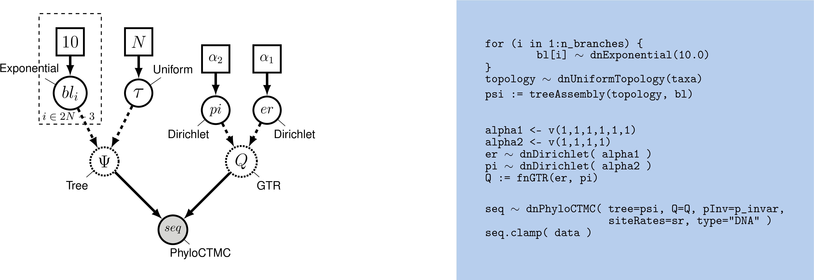

Este tutorial fue traducido y modificado por Ixchel González-Ramírez a partir del tutorial "Nucleotide substitution models" disponible [aquí](https://revbayes.github.io/tutorials/ctmc/) y escrito por **Sebastian Höhna**, **Michael Landis**, **Brian Moore** and **Tracy Heath**

****

 
En este tutorial vamos a demostrar como hacer análisis usando modelos de sustitución de nucleótidos comunes. Los modelos de sustitución que utilizamos en evolución molecular son modelos de tiempo continuo de Markov, los cuales se caracterizan por la matriz de tasas instantáneas, **Q**:

$$Q = \begin{pmatrix}
-\mu_A & \mu_{AC} & \mu_{AG} & \mu_{AT} \\
\mu_{CA} & -\mu_C  & \mu_{CG} & \mu_{CT} \\
\mu_{GA} & \mu_{GC} & -\mu_C  & \mu_{GT} \\
\mu_{TA} & \mu_{TC} & \mu_{TG} & -\mu_T
\end{pmatrix} $$

donde $$\mu_{ij}$$ representa la tasa instantanea de sustitución de el estado $$i$$ al estdo $$j$$. 

Los elementos de la diagonal $$\mu_i$$ son igual a la suma de los elementos en la fila correspondiente y siempre son valores negativos. 
Dada la matriz de tasas instantáneas $$Q$$, podemos calcular las probabilidades de transición correspondientes para una rama de longitud $$t$$, $$P(t)$$, haciendo una exponenciación:

$$P(t) = \begin{pmatrix}
p_{AA}(t) & p_{AC}(t) & p_{AG}(t) & p_{AT}(t) \\
p_{CA}(t) & p_{CC}(t) & p_{CG}(t) & p_{CT}(t) \\
p_{GA}(t) & p_{GC}(t) & p_{GG}(t) & p_{GT}(t) \\
p_{TA}(t) & p_{TC}(t) & p_{TG}(t) & p_{TT}(t)
\end{pmatrix} = e^{Qt} = \sum_{j=0}^\infty\frac{(Qt)^j}{j!}$$

Cada uno de los modelos de sustitucioen conocidos (e.g., HKY o GTR) tienen su propia matriz de tasas instantáneas, $$Q$$.

En este tutorial vamos a hacer una inferencia filogenética bajo dos modelos comunes de evolución de DNA: JC, y GTR. Para ambos modelos de sustitución, configuraremos un análisis de MCMC para estimar la filogenia y otros parámetros del modelo. 



Specific functions for substitution models available in RevBayes.


 |   **Model**      |        **Reference**        |  **Function**   | 
 |:----------------:|:---------------------------:|:---------------:|
 |   Jukes-Cantor   |         |      fnJC       |
 | K80 (a.k.a. K2P) |        |      fnK80      |
 |  Felsenstein-81  |   |      fnF81      |
 |        T92       |        |      fnT92      |
 |        HKY       |      |      fnHKY      |
 |        GTR       |        |      fnGTR      |






>El script para correr esta sección se encuentra en [`mcmc_JC.Rev`](scripts/mcmc_JC.Rev). Sin embargo, te recomiendo que corras paso a paso en tu terminal para ir entendiendo cómo se implementa un análisis.





**Figura 1** Modelo gráfico de un modelo filogenético simple. El modelo gráfico muestra las dependencias entre parámetros . Aquí, la matriz de tasas $$Q$$ es una variable constante ya que es fija y no depende de ningún parámetro. Los únicos parámetros libres de este modelo, el modelo Jukes-Cantor, son el árbol incluyendo las longitudes de las ramas.



Para empezar, consideramos el modelo de sustitución más simple, descrito por
. La matriz de tasas instantáneas de este modelo JC se define como:

$$Q_{JC69} = \begin{pmatrix}
{*} & \frac{1}{3} & \frac{1}{3} & \frac{1}{3} \\
\frac{1}{3} & {*} & \frac{1}{3} & \frac{1}{3} \\
\frac{1}{3} & \frac{1}{3} & {*} & \frac{1}{3} \\
\frac{1}{3} & \frac{1}{3} & \frac{1}{3} & {*}
\end{pmatrix}$$

Lo cual tiene la ventaja de que la matriz de probabilidad de transición se puede calcular analíticamente.

$$P_{JC69} = \begin{pmatrix} {\frac{1}{4} + \frac{3}{4}e^{-rt}} & {\frac{1}{4} - \frac{1}{4}e^{-rt}} & {\frac{1}{4} - \frac{1}{4}e^{-rt}} & {\frac{1}{4} - \frac{1}{4}e^{-rt}} \\\\ {\frac{1}{4} - \frac{1}{4}e^{-rt}} & {\frac{1}{4} + \frac{3}{4}e^{-rt}} & {\frac{1}{4} - \frac{1}{4}e^{-rt}} & {\frac{1}{4} - \frac{1}{4}e^{-rt}} \\\\ {\frac{1}{4} - \frac{1}{4}e^{-rt}} & {\frac{1}{4} - \frac{1}{4}e^{-rt}} & {\frac{1}{4} + \frac{3}{4}e^{-rt}} & {\frac{1}{4} - \frac{1}{4}e^{-rt}} \\\\ {\frac{1}{4} - \frac{1}{4}e^{-rt}} & {\frac{1}{4} - \frac{1}{4}e^{-rt}} & {\frac{1}{4} - \frac{1}{4}e^{-rt}} & {\frac{1}{4} + \frac{3}{4}e^{-rt}}
\end{pmatrix}$$

donde $$t$$ es la longitud de las ramas, y $$r$$ es la tasa del proceso (la velocidad de cambio). Más adelante, vamos a especificar modelos de sustitución más complejos. **Pero no te preocupes, no vamos a calcular todas las probabilidades de transición, RevBayes se encarga de eso con funciones pre-determinadas**.




>Primero creamos un folder para este tutorial llamado `inferencia_datos_moleculares`, o cualquier otro nombre que te parezca adecuado
>
>Dentro de este folder crea un folder llamado `data`.
>
>Descarga los datos [`primates_and_galeopterus_cytb.nex`](data/primates_and_galeopterus_cytb.nex)
>y guárdalos en el folder `data`.
>
>Ahora iniciamos RevBayes en el folder principal que creamos (`inferencia_datos_moleculares`).
{:.instruction}


Primero, cargamos nuestro alineamiento usando la función `readDiscreteCharacterData()`

```
data <- readDiscreteCharacterData("data/primates_and_galeopterus_cytb.nex")
```

Veamos qué contiene el objeto `data`

```
data
```
```
   DNA character matrix with 23 taxa and 1102 characters
   =====================================================
   Origination:                   "primates_and_galeopterus_cytb.nex"
   Number of taxa:                23
   Number of included taxa:       23
   Number of characters:          1102
   Number of included characters: 1102
   Datatype:                      DNA
```
{:.Rev-output}

Después vamos a especificar algunas variables que resultan útiles. La variable `data`, tiene *funciones miembro* que son específicas a este tipo de datos y las cuales podemos usar para encontrar información. 

Chequemos cuáles son dichas funciones:
```
data.methods()
```

Ahora sí, definamos algunas de esas variables:

```
num_taxa <- data.ntaxa()
num_branches <- 2 * num_taxa - 3
taxa <- data.taxa()
```

Adicionalmente, creamos una variable (un vector) que contiene todos los moviemientos (moves) que vamos a especificar en nuestro análisis.
Similarmente, vamos a crear una variable para especificar los "monitores", con los que le indicamos a RevBayes cómo y cuales variables queremos que se escriban en archivos de salida durante el análisis.

```
moves    = VectorMoves()
monitors = VectorMonitors()
```

Quizás hayas notado que usamos el `=` para crear los vectores de movimientos y monitores. Esto simplemente significa que esas variables no son parte del modelo, sino de las instrucciones que le damos a RevBayes acerca de cómo correr la MCMC.

Con los datos cargados, ahora podemos proceder a especificar nuestro modelo.




La estimación filogenética usando el modelo JC require que especifiquemos dos componentes principales, (1) el modelo de sustitución JC, y (2) el modelo del árbol.



Los modelos de sustitución se definen por su matriz de tasas instantáneas $$Q$$. El modelo de sustitución de Jukes-Cantor no tiene parámetros libres (ya que asume que todas las tasas de sustitución son iguales), por lo tanto es una variable constante. La función
`fnJC(n)` crea una tasa instantánea de sustitución JC para un caracter con $$n$$ estados. Como estamos utilizando DNA, creamos una matriz de 4x4:

```
Q <- fnJC(4)
```

Veamos la matriz:

```
Q
```
```
   [ [ -1.0000, 0.3333, 0.3333, 0.3333 ] ,
     [ 0.3333, -1.0000, 0.3333, 0.3333 ] ,
     [ 0.3333, 0.3333, -1.0000, 0.3333 ] ,
     [ 0.3333, 0.3333, 0.3333, -1.0000 ] ]
```
{:.Rev-output}




La topología del árbol y la longitud de ramas son nodos estocásticos en nuestro modelo. 
En el modelo gráfico, la topología del árbol se denota con $$\Psi$$ y la longitud de las ramas $$bl_i$$.

Asumiremos que todas las posibles topologías (no enraizadas) tienen la misma probabilidad. Esto se representa con la distribución `dnUniformTopology()` en RevBayes.

**NOTA:** En RevBayes se recomienda especificar el grupo externo de tu sistema de estudio. Al hacerlo, el monitor de los árboles, escribirá las topologías con el outgroup como grupo heramo del resto, lo que hace la visualización de los árboles más sencillo"


Ahora especificamos la `topology` como un nodo estocástico que proviene de una distribución uniforme de topologías con el argumento `taxa`:

```
out_group = clade("Galeopterus_variegatus")
topology ~ dnUniformTopology(taxa, outgroup=out_group)
```

Vamos a aplicar movimientos a la topología. En este caso, usaremos un *nearest-neighbor interchange move* (`mvNNI`) y un *subtree-prune and regrafting move* (`mvSPR`). 


```
moves.append( mvNNI(topology, weight=num_taxa) )
moves.append( mvSPR(topology, weight=num_taxa/10.0) )
```

El peso de los movimientos especifica qué tan seguido se aplicará este movimiento en relación a otros movimientos.

Enseguida, necesitamos creat un nodo estocástico que represente la longitud de cada una de las $$2N - 3$$ ramas de nuestro árbol (donde $$N=$$ `n_species`). Haremos esto utilizando un *for* loop, y aplicaremos un movimiento a cada rama dentro del mismo loop:

```
for (i in 1:num_branches) {
   br_lens[i] ~ dnExponential(10.0)
   moves.append( mvScale(br_lens[i]) )
}
```

Es conveniente monitorear la longitude del árbol, la cuál es un nodo determinista. La longitud del árbol es simplemente la suma de la longitud de todas las ramas.

```
TL := sum(br_lens)
```

Finalmente, podemos crear un *filograma* (una filogenia en la que la longitud de las ramas es proporcional an numero esperado de sustiticiones por sitio) combinando la topología y las longitudes de rama. Logramos esto usando la función `treeAssembly()`:

```
psi := treeAssembly(topology, br_lens)
```




Hemos terminado de especificar todos los parámetros de nuestro modelo filogenético. Colectivamente, estos parámetros comprenden una distribución llamada *phylogenetic continuous-time Markov chain*, y usamos la función `dnPhyloCTMC` para crear este nodo. Esta distribución requiere varios argumentos:
1. el árbol con longitud de ramas;
2. la matriz de tasas instantáneas `Q`;
3. el tipo de datos.

```
seq ~ dnPhyloCTMC(tree=psi, Q=Q, type="DNA")
```

Una vez que creamos el nodo `PhyloCTMC`, le podemos pinzar nuestros datos:

```
seq.clamp(data)
```
Cuando utilizamos la función `.clamp()` RevBayes asigna a cada terminal la secuencia correspondiente de nuestros datos. Esencialmente, le decimos al programa que tenemos datos observados de las secuencias en los terminales. 

Finalmente, *envolvemos* el modelo en un único objeto llamado `mymodel`. Para ellos, utilizamos la función `model()` a la que le damos un único nodo. Con este nodo, la función `model()` puede encontrar el resto de los nodos, ya que están relacionados. 

```
mymodel = model(Q)
```


Vamos a ver nuestro modelo

```
mymodel
```

<!--


In this section, we will describe how to set up the MCMC sampler and
summarize the resulting posterior distribution of trees.
 -->




Para nuestra MCMC, necesitamos especificar un vector de *monitores* que
registren los estados de nuestras cadenas de Markov. 
Las funciones monitor, siempre empiezan con `mn\*`, donde `\*` especifica el tipo de monitor.
Primero iniciamos un monitor de modelo `mnModel`. Esta función escribe todos los estados de todos los parámetros del modelo durante la MCMC.

```
monitors.append( mnModel(filename="output/primates_cytb_JC.log", printgen=10) )
```

El monitor `mnFile` escribe los valores de los parámetros que especificamos.

```
monitors.append( mnFile(filename="output/primates_cytb_JC.trees", printgen=10, psi) )
```

Finalmente creamos un monitor de pantalla que nos va a reportar los estados en nuestra pantalla en tiempo real mientras la cadena corre

Finally, create a screen monitor that will report the states of
specified variables to the screen with `mnScreen`:

```
monitors.append( mnScreen(printgen=100, TL) )
```

Este monitor nos permite ver el progreso de la MCMC.



Ya que tenemos el modelo, los monitores y los moviemientos especificados, podemos crear nuestro objeto MCMC con la función `mcmc()` 

```
mymcmc = mcmc(mymodel, monitors, moves)
```

Ahora corremos la MCMC, especificando el número de generaciones:

```
mymcmc.run(generations=20000)
```

Una vez que el análisis haya concluido podemos observar los archivos de salida.




Para visualizar las probabilidades de los parámetros usamos programas como  [Tracer](http://tree.bio.ed.ac.uk/software/tracer/) .

Observa el archivo `output/primates_cytb_JC.log` en Tracer.
Ahí observamos la distribución posterior de los parámetros continuos.




Estamos interesados en las relaciones filogenéticas de los Tarsiers

We are interested in the phylogenetic relationship of the Tarsiers. Por lo que vamos a resumir nuestra muestra posterior de árboles utilizando. Primero leemos nuestra muestra de árboles:


```
treetrace = readTreeTrace("output/primates_cytb_JC.trees", treetype="non-clock")
```

La función `mapTree()` escribe el árbol de 
**máximo a posteriori** :

```
map_tree = mapTree(treetrace, "output/primates_cytb_JC_MAP.tree")
```


Veamos el árbol MAP `output/primates_cytb_JC_MAP.tree` en
`FigTree`. 




Ahora, especificamos el modelo de sustitución (GTR) , el cual permite que las 6 tasas de intercambio sean diferentes. 

La matriz de tasas instantáneas es del modelo GTR es:

$$ Q_{GTR} = \begin{pmatrix}
{\cdot}	   & {r_{AC}\pi_C} & {r_{AG}\pi_G} & {r_{AT}\pi_T} \\
{r_{AC}\pi_A} & {\cdot}       & {r_{CG}\pi_G} & {r_{CT}\pi_T} \\
{r_{AG}\pi_A} & {r_{CG}\pi_C} & {\cdot}       & {r_{GT}\pi_T} \\
{r_{AT}\pi_A} & {r_{CT}\pi_C} & {r_{GT}\pi_G} & {\cdot}       \\
\end{pmatrix} $$

donde los 6 parámetros de intercambio, $$r_{ij}$$, especifican las tasas de cambio entre $$i$$ and $$j$$.




**Figura2** Representación gráfica del modelo GTR.



El modelo GTR requiere que especifiquemos un prior en las seis tasas de intercambio, para lo cual usaremos la distribución dirichlet. 
Primero definimos un nodo constante para especificar el vector del parámetro de concentración utilizando la función `v()`:

```
er_prior <- v(1,1,1,1,1,1)
```

Ahora podemos crear un nodo estocástico para las tasas de intercambio, utilizando la función `dnDirichlet()`, 
la cual toma los valores del vector de concentraciones como argumento. 
Together, these create a stochastic node
named `er`.

```
er ~ dnDirichlet(er_prior)
```
La distribución dirchlet asigna densidad de probabilidades a un conjunto de parametros, por ejemplo aquellos que miden proporciones y deben sumar 1. Aquí, especificamos una Dirichlet de 6 parámetros, donde cada valor corresponde a una de las seis tasas del modelo GTR
(1) $$A\leftrightarrows C$$; (2) $$A\leftrightarrows G$$; (3) $$A\leftrightarrows T$$; (4) $$C\leftrightarrows G$$; (5) $$C\leftrightarrows T$$; (6) $$G\leftrightarrows T$$. 
Los parámetros de entrada de la dirichlet se llaman "concentraciones". En este caso especificamos una dirichlet *plana*, con todos los parámetros de concentración iguales (1,1,1,1,1,1). 

<!--
We might also parameterize the Dirichlet distribution such that all of the shape parameters were equal to 100, which would also specify a prior with an expectation of equal exchangeability rates (b). However, by increasing the values of the shape parameters, `er_prior <- v(100,100,100,100,100,100)`, the Dirichlet distribution will more strongly favor equal exchangeability rates; (*i.e.*, a relatively informative prior).

Alternatively, we might consider an asymmetric Dirichlet parameterization that could reflect a strong prior belief that transition and transversion substitutions occur at different rates. For example, we might specify the prior density `er_prior <- v(4,8,4,4,8,4)`. Under this model, the expected rate for transversions would be $\frac{4}{32}$ and that for transitions would be $\frac{8}{32}$, and there would be greater prior probability on sets of GTR rates that matched this configuration (c).

Yet another asymmetric prior could specify that each of the six GTR rates had a different value conforming to a Dirichlet(2,4,6,8,10,12). This would lead to a different prior probability density for each rate parameter (d). Without strong prior knowledge about the pattern of relative rates, however, we can better reflect our uncertainty by using a vague prior on the GTR rates. Notably, all patterns of relative rates have the same probability density under `er_prior <- v(1,1,1,1,1,1)`.
 -->




Cuatro ejemplos de priors en nuestra distribución dirchlet en las tasas the intercambio.



Para cada nodo estocástico de nuestro modelo, también tenemos que especificar movimientos si queremos estimar los parámetros. 

```
moves.append( mvBetaSimplex(er, weight=3) )
moves.append( mvDirichletSimplex(er, weight=1) )
```
Podemos utilizar el mismo tipo de distribución para las 4 frecuencias estacionarias ($$\pi_A, \pi_C, \pi_G, \pi_T$$) 
ya que estos parámetros también representan proporciones. 

```
pi_prior <- v(1,1,1,1)
pi ~ dnDirichlet(pi_prior)
```

Ahora agregamos movimientos en las frecuencias estacionarias:

```
moves.append( mvBetaSimplex(pi, weight=2) )
moves.append( mvDirichletSimplex(pi, weight=1) )
```

Terminamos esta sección del modelo creando el nodo determinista para la matriz de tasas instantáneas `Q`. 
Utilizamos la función `fnGTR()` para calcular el nodo determinista `Q`:

```
Q := fnGTR(er,pi)
```



-   Usando como base el análisis con el modelo Jukes Cantor, modifica tu código y especifica un análisis GTR analysis en un archivo nuevo llamado `mcmc_GTR.Rev`. 

-   Corre una MCMC


<!--


Members of the GTR family of substitution models assume that rates are homogeneous across sites, an assumption that is often violated by real data. We can accommodate variation in substitution rate among sites (ASRV) by adopting the discrete-gamma model . This model assumes that the substitution rate at each site is a random variable that is described by a discretized gamma distribution, which has two parameters: the shape parameter, $\alpha$, and the rate parameter, $\beta$. In order that we can interpret the branch lengths as the expected number of substitutions per site, this model assumes that the mean site rate is equal to 1. The mean of the gamma is equal to $\alpha/\beta$, so a mean-one gamma is specified by setting the two parameters to be equal, $\alpha=\beta$. This means that we can fully describe the gamma distribution with the single shape parameter, $\alpha$. The degree of among-site substitution rate variation is inversely proportional to the value of the $\alpha$-shape parameter. As the value of the $\alpha$-shape increases, the gamma distribution increasingly resembles a normal distribution with decreasing variance, which therefore corresponds to decreasing levels of ASRV (). By contrast, when the value of the $\alpha$-shape parameter is $< 1$, the gamma distribution assumes a concave distribution that concentrates most of the prior density on low rates, but retains some prior mass on sites with very high rates, which therefore corresponds to high levels of ASRV (). Note that, when $\alpha = 1$, the gamma distribution collapses to an exponential distribution with a rate parameter equal to $\beta$.




The probability density of mean-one gamma-distributed rates for different values of the $\alpha$-shape parameter.



We typically lack prior knowledge regarding the degree of ASRV for a given alignment.
Accordingly, rather than specifying a precise value of $\alpha$, we can instead estimate the value of the $\alpha$-shape parameter from the data. This requires that we specify a diffuse (relatively ['uninformative'](http://andrewgelman.com/2013/11/21/hidden-dangers-noninformative-priors/)) prior on the $\alpha$-shape parameter. For this analysis, we will use a uniform distribution between 0 and 10.

This approach for accommodating ASRV is another example of a hierarchical model ().
That is, variation in substitution rates across sites is addressed by applying a site-specific rate multiplier to each of the $j$ sites, $r_j$.
These rate-multipliers are drawn from a discrete, mean-one gamma distribution; the shape of this prior distribution (and the corresponding degree of ASRV) is governed by the $\alpha$-shape parameter. The $\alpha$-shape parameter, in turn, is treated as a lognormal distributed random variable. Finally, the shape of the lognormal prior is governed by the mean and standard deviation parameters, which are set to fixed values.




Graphical model representation of the General Time Reversible (GTR) + Gamma phylogenetic model with invariable sites.





Then create a stochastic node called `alpha` with a uniform prior distribution between 0.0 and $10$
(this represents the stochastic node for the $\alpha$-shape parameter in
):

```
alpha ~ dnUniform( 0.0, 10 )
```

Then create a stochastic node called `alpha` with a uniform prior distribution between 0.0 and $10^8$
(this represents the stochastic node for the $\alpha$-shape parameter in
):

```
alpha ~ dnUniform( 0.0, 1E8 )
alpha.setValue(1.0)
```
Note that we initialized the value of `alpha` to $1.0$. This is strictly speaking not necessary but helps tremendously the MCMC to converge.
As a general rule, it is possible to initialize starting values for the MCMC using the *setValue( xx )* function, which is available for every stochastic variable,
but it might also make your replicated MCMC runs to be more likely to get stuck in the same local area of parameters.


The way the ASRV model is implemented involves discretizing the mean-one gamma distribution into a set number of rate categories, $k$. Thus, we can analytically marginalize over the uncertainty in the rate at each site. The likelihood of each site is averaged over the $k$ rate categories, where the rate multiplier is the mean (or median) of each of the discrete $k$ categories. To specify this, we need a deterministic node that is a vector that will hold the set of $k$ rates drawn from the gamma distribution with $k$ rate categories. The `fnDiscretizeGamma()` function returns this deterministic node and takes three arguments: the shape and rate of the gamma distribution and the number of categories. Since we want to discretize a mean-one gamma distribution, we can pass in `alpha` for both the shape and rate.

Initialize the `sr` deterministic node vector using the `fnDiscretizeGamma()` function with `4` bins:

```
sr := fnDiscretizeGamma( alpha, alpha, 4 )
```

Note that here, by convention, we set $k = 4$. The random variable that controls the rate variation is the stochastic node `alpha`. We will apply a simple scale move to this parameter.

```
moves.append( mvScale(alpha, weight=2.0) )
```

Remember that you need to call the `PhyloCTMC` constructor to include the new site-rate parameter:

```
seq ~ dnPhyloCTMC(tree=psi, Q=Q, siteRates=sr, type="DNA")
```




-   Modify the previous GTR analysis to specify the GTR+Gamma model.
    Run an MCMC simulation to estimate the posterior distribution.

-   Is there an impact on the estimated phylogeny compared with the
    previous analyses? Look at the MAP tree and the posterior
    probabilities of the clades.

-   Complete the table of the phylogenetic relationship of primates.



All of the substitution models described so far assume that the sequence data are potentially variable. That is, we assume that the sequence data are random variables; specifically, we assume that they are realizations of the specified `PhyloCTMC` distribution. However, some sites may not be free to vary—when the substitution rate of a site is zero, it is said to be *invariable*. Invariable sites are often confused with *invariant* sites—when each species exhibits the same state, it is said to be invariant. The concepts are related but distinct. If a site is truly invariable, it will necessarily give rise to an invariant site pattern, as such sites will always have a zero substitution rate. However, an invariant site pattern may be achieved via multiple substitutions that happen to end in the same state for every species.

Here we describe an extension to our phylogenetic model to accommodate invariable sites. Under the invariable-sites model , each site is invariable with probability `p_inv`, and variable with probability $1-$`p_inv`.

First, let’s have a look at the data and see how many invariant sites we have:

```
data.getNumInvariantSites()
```

There seem to be a substantial number of invariant sites.

Now let’s specify the invariable-sites model in RevBayes. We need to specify the prior probability that a site is invariable. A Beta distribution is a common choice for parameters representing probabilities.

```
p_inv ~ dnBeta(1,1)
```

The `Beta(1,1)` distribution is a flat prior distribution that specifies equal probability for all values between 0 and 1.

Then, as usual, we add a move to change this stochastic variable; we’ll use a simple sliding window move.

```
moves.append( mvSlide(p_inv) )
```

Finally, you need to call the `PhyloCTMC` constructor to include the
new `p_inv` parameter:

```
seq ~ dnPhyloCTMC(tree=psi, Q=Q, siteRates=sr, pInv=p_inv, type="DNA")
```



-   Extend the GTR model to account for invariable sites and run
    an analysis.

-   What is the estimated probability of invariable sites and how does
    it relate to the ratio of invariant sites to the total number of
    sites?

-   Extend the GTR+$\Gamma$ model to account for invariable sites and
    run an analysis.

-   What is the estimated probability of invariable sites now?

-   Complete the table of the phylogenetic relationship of primates.
 -->