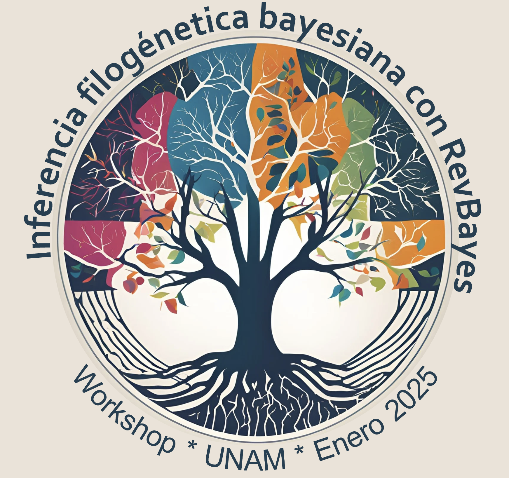
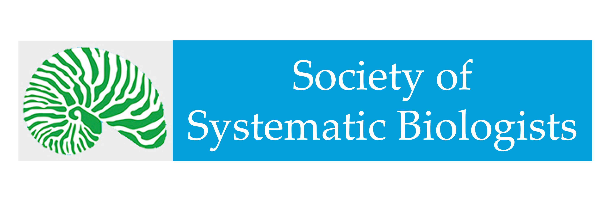

Este es un taller dirigido a estudiantes de posgrado de la UNAM (Universidad Nacional Autónoma de México). En el taller comenzaremos con una revisión de los conceptos básicos de filogenética bayesiana. Después, utilizaremos estos fundamentos para estudiar algunos de los modelos más utilizados en filogenética (por ejemplo, modelos de estimación de tiempos de divergencia, evolución de caracteres discretos, biogeografía y tasas de diversificación). 

Durante este taller nos enfocaremos en entender los modelos *per se*, cómo se aplican en inferencia bayesiana (específicamente usando RevBayes) y cuáles son sus implicaciones prácticas. Este taller será una combinación de clases, discusiones y tutoriales guiados. Todos los materiales estarán disponibles en español en esta página. 

#### Objetivos

* Discutir el enfoque Bayesiano en inferencia filogenética.

* Introducir el uso de RevBayes (un software diseñado para inferencia filogenética que requiere programación). 

* Utilizar algunos de los modelos filogenéticos más usados para que los participantes se familiaricen con los modelos filogenéticos y su implementación en RevBayes.

* Proporcionar un espacio para que los participantes convivar con los instructores y discutan sus ideas y dudas relacionadas con sus preguntas de investigación.

**Ojo:** El taller no tiene valor curricular.

## Lugar y fecha

El taller será impartido de 9AM a 6PM, del 8 al 10 de Enero, en el Instituto de Biología, UNAM. 

## Equipo de instructores
  
Dra. Rosana Zenil-Ferguson (Dept. of Biology, University of Kentucky); Dra. Ixchel González Ramírez (Dept. of Integrative Biology and UC Jepson Herbarium, UC Berkeley); Dr. Santiago Ramírez Barahona (Instituto de Biología, UNAM); Dra. Susana Magallónc (Instituto de Biología, UNAM); Dra. Jenna McCullough (Dept. of Biology, University of Kentucky); Ms. Sc. Nicolás Castillo Rodríguez (Dept. of Biology, University of Kentucky).

***

#### Agradecemos a la Sociedad de Biólogos Sistématas (SSB) por su apoyo para financiar este taller. 

